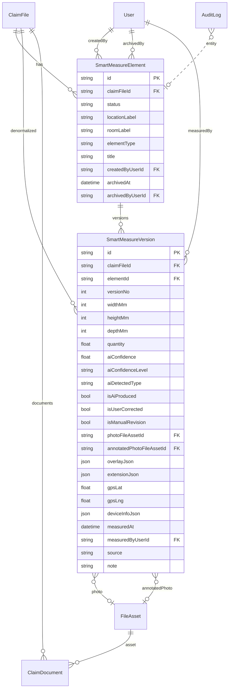

# Akıllı Ölçüm — Nihai Mimari v2 (Onaylı + Revizyon 1–10)

**Tarih:** 2026-08-01  
**Durum:** Mimari onaylandı + kod hizalı.  
**Migration canlı:** `20260801163000_smart_measures_mm_evidence` **UYGULANDI** (2026-08-01) — ALTER; eski cm/photo_url kolonları v436 uyumu için bırakıldı.  
**Commit / Deploy (yeni kod image):** **YOK** — ayrı onay bekleniyor.

Taslak artefaktlar:
- `docs/features/ai-ar-smart-measure/DRAFT_prisma_models.prisma`
- `docs/features/ai-ar-smart-measure/DRAFT_migration.sql`

---

## Kilitli kararlar (birleşik)

Önceki 1–14 + yeni 1–10 revizyonları geçerlidir. Öne çıkanlar:

| Konu | Karar |
|------|--------|
| Domain | `smart_measure_elements` + `smart_measure_versions` |
| FieldSurvey | Birleştirme yok |
| Version | Append-only; UPDATE/DELETE ölçü yok |
| Soft delete | Element: `archived_at` + `archived_by_user_id`; Version asla silinmez |
| Tenant | Her işlemde ClaimFile üzerinden `assertClaimFileAccess` |
| Durum | Element `status`: draft / measured / reviewed / approved / archived |
| AI | `ai_confidence` (0–1) + `ai_confidence_level` (very_high…low) |
| Kalite bayrakları | `is_ai_produced`, `is_user_corrected`, `is_manual_revision` |
| Birim | DB + API = **mm (int)**; UI dönüştürür (mm/cm/m/inch) |
| source | TEXT (genişletilebilir); Prisma enum yok |
| Foto | FileAsset + ClaimDocument |
| Evidence Chain | Version + FileAsset + AuditLog |
| Event | Şimdilik emit yok; servis hook noktaları hazır |
| Metraj/PDF | Tablo yok |

---

## 1) Nihai ER Diyagramı



---

## 2) Domain modeli (özet)

- **Aggregate:** SmartMeasureElement  
- **Append-only child:** SmartMeasureVersion (`claim_file_id` denormalize — tenant/filtre/index)  
- **Status machine (element):**  
  `draft → measured → reviewed → approved` · herhangi birinden → `archived`  
  `archived` ⇔ `archived_at` + `archived_by_user_id` set  
- **AI level (persist, version yazımında hesaplanır):**

| Level | Aralık (öneri) |
|-------|----------------|
| very_high | ≥ 0.90 |
| high | ≥ 0.75 |
| medium | ≥ 0.50 |
| low | &lt; 0.50 / null confidence → null level |

UI Title Case: Very High / High / Medium / Low.

---

## 3) Tenant güvenliği

Meridyen’de ayrı `tenant_id` kolonu yok; izolasyon **ClaimFile.insuranceCompanyId + assertClaimFileAccess** ile yapılır.

**Zorunlu servis kuralı:**

```
her SM endpoint:
  1) ClaimFile yükle (id + insuranceCompanyId + atama alanları)
  2) assertClaimFileAccess(claimFile, user, insuranceScopes, …)
  3) sonra element/version işle
```

- `assertClaimFileExists` yalnız id kontrolü **yetersiz** (mevcut WIP açığı; nihai kodda kapatılacak).
- Liste/filtre: her zaman `claimFileId` path param + erişim assert; version sorgularında ek olarak `version.claim_file_id = :claimFileId`.
- Hiçbir raw query ClaimFile doğrulaması olmadan element/version id ile çalışmaz.

---

## 4) Soft delete

| Entity | Silme | Davranış |
|--------|-------|----------|
| Element | Soft | `status=archived`, `archived_at`, `archived_by_user_id` |
| Version | Yok | Fiziksel/logical delete endpoint yok |

Liste varsayılan: `status != archived` (veya `archived_at IS NULL`).

---

## 5) API (mm-only) — ekler

Önceki endpoint’ler aynı. Ek / netleşenler:

| Method | Path | Not |
|--------|------|-----|
| POST | `/:elementId/status` | status geçişi + audit (+ ileride Approved/Archived event) |
| POST | `/:elementId/archive` | soft archive |

Create/Version DTO: yalnızca `widthMm` / `heightMm` / `depthMm` (int).  
Bayraklar: `isAiProduced`, `isUserCorrected`, `isManualRevision`.  
`source`: string (ör. `mobile_ar`, `lidar`, `manual`, …).

---

## 6) Domain event hazırlığı (emit yok)

Servis içinde private hook’lar (no-op / structured log):

```
onSmartMeasureCreated(payload)
onSmartMeasureRevised(payload)
onSmartMeasureApproved(payload)
onSmartMeasureArchived(payload)
```

İleride Event Bus’a taşınır; şimdi bus yok.

---

## 7) Index planı

### Element

| Index | Kolonlar |
|-------|----------|
| idx_sme_claim_created | (claim_file_id, created_at) |
| idx_sme_claim_status | (claim_file_id, status) |
| idx_sme_created_by | (created_by_user_id) |
| idx_sme_element_type | (element_type) |
| idx_sme_archived | (archived_at) |

### Version

| Index | Kolonlar | Gerekçe |
|-------|----------|---------|
| uq_smv_element_ver | UNIQUE (element_id, version_no) | |
| idx_smv_claim_measured | (claim_file_id, measured_at DESC) | dosya timeline |
| idx_smv_element_ver | (element_id, version_no) | geçmiş |
| idx_smv_measured_at | (measured_at) | rapor |
| idx_smv_measured_by | (measured_by_user_id) | “created_by” eşdeğeri ölçen |
| idx_smv_source | (source) | kaynak analizi |
| idx_smv_claim_source | (claim_file_id, source) | tenant-safe filtre |
| idx_smv_ai_level | (ai_confidence_level) | kalite filtre |

Not: Version’da `created_by` yok; oluşturan element’te, ölçen `measured_by_user_id`. Index planı buna göre.

---

## 8) FK yapısı

| From | To | On delete |
|------|-----|-----------|
| elements.claim_file_id | claim_files.id | CASCADE |
| elements.created_by_user_id | users.id | RESTRICT |
| elements.archived_by_user_id | users.id | SET NULL |
| versions.element_id | elements.id | CASCADE |
| versions.claim_file_id | claim_files.id | CASCADE |
| versions.measured_by_user_id | users.id | RESTRICT |
| versions.photo_file_asset_id | file_assets.id | SET NULL |
| versions.annotated_photo_file_asset_id | file_assets.id | SET NULL |

---

## 9) Birim

- DB: mm int  
- API request/response kanonik: mm (türetilmiş areaMm2 vb. response’ta)  
- Web/Mobil: görüntü dönüşümü; **hesap yok** gösterim biriminde  
- inch: yalnız UI (gelecek)

---

## 10) Sonraki kapılar

1. ~~Mimari~~ + revizyonlar → bu belge  
2. **Migration taslağı onayı** (çalıştırmadan)  
3. Uygulama kodu (mm, FileAsset, tenant assert, status)  
4. Migration çalıştır → ayrı onay  
5. Commit → ayrı onay  
6. SM-only deploy → ayrı onay
