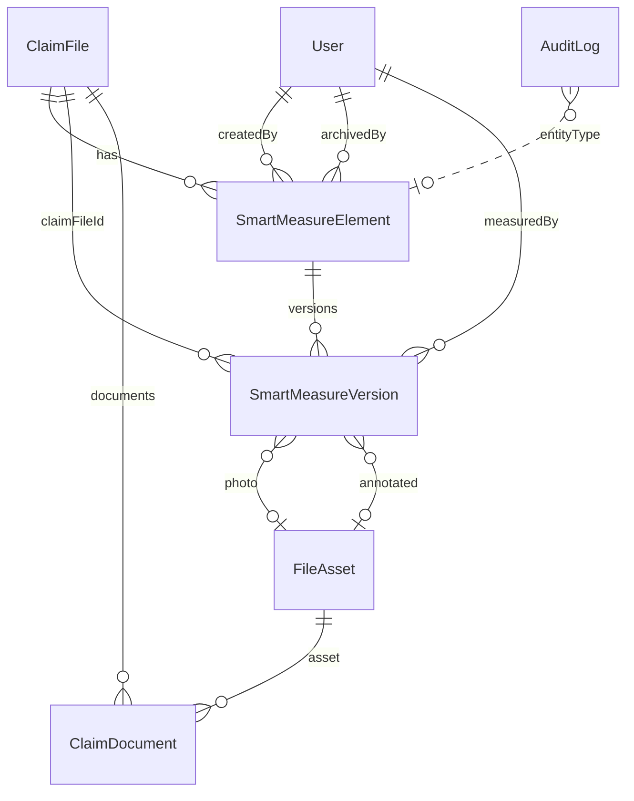

# Akıllı Ölçüm — Teknik Teslim Raporu

**Modül:** AI + AR Akıllı Ölçüm (Smart Measurement)  
**Durum:** **Closed** (Faz 1 tamamlandı)  
**Tarih:** 2026-08-01  
**Canlı:** Web **v438** + Backend **v437**  
**Git (özellik):** `cc022bf` — mm Evidence Chain · `b1e4eb9` — SmartMeasureList mount SSOT  
**Git (operasyon):** `chore(deploy): KNOWN_GOOD v438-smart-measure-page-ssot`  
**Rollback web:** v437 · **Rollback backend:** v436  
**Migration canlı:** `20260801140000_smart_measures` + `20260801163000_smart_measures_mm_evidence`  
**Kapanış raporu:** `docs/features/AI_AR_AKILLI_OLCUM_FAZ1_KAPANIS.md`  
**Not:** Field Survey / CRM / Finans / Dashboard WIP ayrıldı (`docs/project-governance/inbox/WIP_NON_SM_20260801/`).

---

## 1) Nihai Mimari Özeti

Üç katmanlı kurumsal ölçüm sistemi:

| Katman | Rol |
|--------|-----|
| AR Ölçüm Motoru | Cihaz ARKit/ARCore (mobil); mesafe algoritması sıfırdan yazılmaz |
| AI Nesne Tanıma | Tip + güven + sınır; persist detect’te yok, kayıtta version’a yazılır |
| Operasyon Zekâsı | mm ölçü → metraj (dinamik) + PDF (dinamik) + dosya Evidence Chain |

**ClaimFile’a entegre**, FieldSurveyBrief ile **birleştirilmez**.  
Tenant: her istekte `ClaimFilesService.findOne` → `assertClaimFileAccess`.

---

## 2) ER Diyagramı



Detay: `docs/features/AI_AR_AKILLI_OLCUM_MIMARI.md`

---

## 3) Veritabanı Şeması

### `smart_measure_elements`
- Kimlik: mahal / oda / element_type / title  
- `status`: draft | measured | reviewed | approved | archived  
- Soft archive: `archived_at`, `archived_by_user_id`  
- Hard delete yok  

### `smart_measure_versions` (append-only)
- `claim_file_id` (denormalize — index/tenant)  
- `width_mm`, `height_mm`, `depth_mm` (INT)  
- `quantity`, AI alanları, kalite bayrakları  
- `photo_file_asset_id`, `annotated_photo_file_asset_id`  
- `overlay_json`, `extension_json`, GPS, `device_info_json`  
- `source` (TEXT, genişletilebilir), `measured_at`, `measured_by_user_id`  

**Saklanmayan:** area/perimeter/volume kolonları, metraj tablosu, PDF tablosu.  
**Canlıda bırakılan legacy (v436 uyumu):** `*_cm`, `photo_url` — yeni kod kullanmaz; temizleme ayrı faz.

---

## 4) API Endpoint Listesi

Base: `/api/v1/claim-files/:claimFileId/smart-measures`

| Method | Path | Yetki |
|--------|------|--------|
| POST | `/photo` | claim_file.update → FileAsset + ClaimDocument |
| POST | `/detect` | claim_file.update → AI öneri (persist yok) |
| POST | `/` | claim_file.update → Element + Version#1 (mm) |
| GET | `/` | claim_file.view → liste + metraj |
| GET | `/:elementId` | claim_file.view → geçmiş + metraj |
| GET | `/:elementId/pdf` | claim_file.view → dinamik PDF |
| POST | `/:elementId/versions` | claim_file.update → yeni sürüm |
| POST | `/:elementId/status` | claim_file.update |
| POST | `/:elementId/archive` | claim_file.update → soft archive |

**Yasak:** ölçü UPDATE/PUT; version DELETE.

---

## 5) Domain Modeli

- **Bounded context:** Smart Measurement  
- **Aggregate kök:** `SmartMeasureElement`  
- **Append-only entity:** `SmartMeasureVersion`  
- **Shared kernel:** ClaimFile, User, FileAsset, ClaimDocument, AuditLog  
- **Hariç context:** FieldSurveyBrief (keşif)  

---

## 6) Evidence Chain Yapısı

```
SmartMeasureVersion  +  FileAsset (+ ClaimDocument)  +  AuditLog
= kurumsal Evidence Chain
```

- Version satırları silinmez  
- Foto binary FileAsset’te; version yalnızca FK  
- Audit: `smart_measure.create` / `revise` / `status`  

---

## 7) FileAsset Entegrasyonu

1. `POST /photo` → Storage upload (`smart-measures/…`)  
2. `FileAsset` (`ownerType=claim_file`, `category=smart_measure`)  
3. `ClaimDocument` (`documentType=smart_measure_photo`)  
4. Create/version DTO: `photoFileAssetId` / `annotatedPhotoFileAssetId`  
5. Asset’in aynı `claimFileId`’ye ait olduğu doğrulanır  

---

## 8) Audit Yapısı

Mevcut `AuditLog` servisi; yeni audit tablosu yok.

| Action | Ne zaman |
|--------|----------|
| `smart_measure.create` | İlk kayıt |
| `smart_measure.revise` | Yeni version |
| `smart_measure.status` | Durum / archive |

---

## 9) Version Yapısı

- Her revizyon **yeni satır**; üzerine yazma yok  
- `version_no` element içinde unique  
- Kalite: `is_ai_produced`, `is_user_corrected`, `is_manual_revision`  
- AI: `ai_confidence` + `ai_confidence_level` (very_high…low)  

Domain event hook’ları (emit yok): Created / Revised / Approved / Archived.

---

## 10) Ölçü Birimi Standardı

| Katman | Uzunluk |
|--------|---------|
| DB | **mm (integer)** |
| API | **mm** (kanonik) |
| Web / Mobil UI | mm / cm / m / (ileride inch) — **yalnız görüntü dönüşümü** |

Alan/çevre/hacim/metraj: mm’den türetilir; UI birimiyle hesap yapılmaz.

---

## 11) Gelecekte Desteklenecek Özellikler

`source` + `extension_json` ile şema redesign olmadan:

LiDAR · 3D Room Scan · Video · Drone · BIM/CAD import · Digital Twin · çoklu oda · kat planı · AI hasar analizi

---

## 12) Kullanılan Teknolojiler

| Katman | Teknoloji |
|--------|-----------|
| Backend | NestJS, Prisma, Puppeteer (PDF), Storage (S3/local) |
| Web | Next.js, axios, SmartMeasureList |
| Mobil | Expo, expo-dev-client, `@reactvision/react-viro` (AR) |
| AI detect | OpenAI vision (opsiyonel; anahtar yoksa graceful) |
| Deploy | Docker amd64, compose project `sigorta-hasar-sistemi` |

---

## 13) Bilinen Kısıtlar

1. **Legacy kolonlar** canlıda duruyor (`*_cm`, `photo_url`) — yeni kod kullanmıyor.  
2. ~~**`hasar-dosyalari/[id]/page.tsx` SmartMeasureList mount’u `cc022bf` içinde yok**~~ → **Giderildi:** `fix/smart-measure-page-mount-ssot` (Raporlar sekmesinde `SmartMeasureList`).  
3. **`pnpm-lock.yaml`** mobil AR paketleriyle hizalı commit’te yoktu; lock güncellemesi ayrı iş.  
4. Expo Go’da Viro AR yok — development build gerekir.  
5. Event Bus henüz yok (hook no-op).  
6. Production Browser kabulü Cursor yapmaz — kullanıcı doğrular.

---

## 14) Sonraki Faz Önerileri

| Öncelik | Öneri |
|---------|--------|
| P0 | ~~`page.tsx` SmartMeasureList mount~~ ✅ `fix/smart-measure-page-mount-ssot` |
| P0 | `pnpm-lock.yaml` mobil bağımlılık senkronu |
| P1 | Legacy `*_cm` / `photo_url` drop migration (deploy sonrası) |
| P1 | Foto backfill / ClaimDocument görünürlük UX |
| P2 | Event Bus’a SmartMeasure* event’leri |
| P2 | Kapı dışı element tipleri için mobil akışlar |
| — | Field Survey WIP: `WIP_NON_SM_20260801` → ayrı feature branch |

---

## Modül sınırları (kalıcı)

- **İçinde:** `apps/backend/src/modules/smart-measures/**`, web `components/smart-measures/**`, mobil `smart-measure/**`, ilgili prisma migration’lar, bu doküman seti  
- **Dışında:** FieldSurvey*, CRM, Finans, Dashboard, Layout, Storage ensureBucket, Eksper drawer keşif listesi  

Bundan sonraki SM işleri: **yeni feature branch** (ör. `feature/smart-measure-…`).  
Bu aşamada commit / merge / deploy / migration **yapılmadı**.
