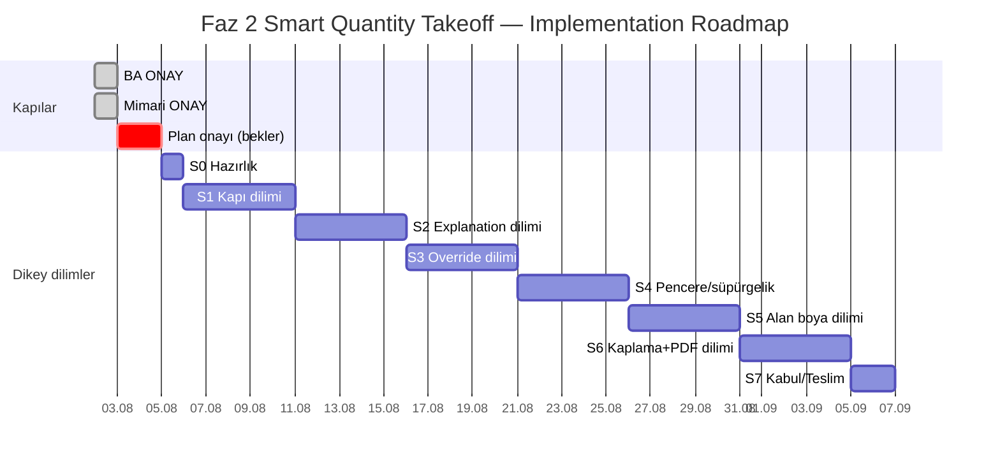

# Faz 2 — Smart Quantity Takeoff

# Implementation Plan

| Alan | Değer |
|------|--------|
| Doküman türü | Implementation Plan |
| Faz | **FAZ 2** |
| Modül | Smart Quantity Takeoff |
| Durum | **ONAYLANDI / KİLİTLİ** (2026-08-02) |
| Tarih | 2026-08-02 |
| Bağlı BA | `SMART_QUANTITY_TAKEOFF_IS_ANALIZI.md` — ONAYLI / KİLİTLİ |
| Bağlı Mimari | `SMART_QUANTITY_TAKEOFF_MIMARI.md` — ONAYLI / KİLİTLİ |
| Anayasa | `docs/project-governance/MERIDYEN_PLATFORM_PRENSIPLERI.md` — ONAYLI · **STABLE** |
| ADR Index | `docs/project-governance/ADR_INDEX.md` |
| Metodoloji | **STABLE** — odak ürün; rutin yeni prensip yok |
| Kilit | Bundan sonra geliştirme yalnız bu plana + anayasaya göre |
| Kısıt (bu güncelleme) | Kod · migration · commit · branch · deploy **yok** |

**Kapı sırası (zorunlu):**

```
İş Analizi (ONAY) ✓
  ↓
Mimari Tasarım (ONAY) ✓
  ↓
Implementation Plan (ONAY / KİLİTLİ) ✓
  ↓
Geliştirme (sprint + Review Gate)
```

Hiçbir geliştirme bu plana aykırı başlatılmaz.  
Mimari §19 stratejik prensipler (Business Knowledge Layer, ML, Faz 3–5 ürünleri) **v1 implementation kapsamı dışıdır**.  
Geliştirme prensipleri: **§11**. Meridyen ürün standardı: **§12**.

---

## 1. Sprint Planı

> **Vertical Slice (§11.1):** Her sprint, yarım katman bırakmadan uçtan uca çalışan ince bir dilim teslim eder (Backend · API · Rule/Engine · UI · Test · Dokümantasyon).

| Sprint | Süre (öneri) | Dikey dilim (uçtan uca) | Çıktı |
|--------|--------------|-------------------------|--------|
| **S0 — Hazırlık** | 0,5–1 gün | Branch iskeleti, DoD/Review Gate checklist, feature-toggle hazırlık noktaları (implement yok) | Hazır BC iskeleti |
| **S1 — İlk dilim (Kapı → 1+ iş kalemi)** | 3–5 gün | Minimal şema + SM port + Decision/Calculation (kapı) + run API + basit UI listesi + test + docs notu | Çalışan ince dilim |
| **S2 — Explanation + Version bağ** | 3–5 gün | Explanation persist/UI, RuleVersion bağının dilimde görünmesi, test, docs | Açıklanabilir dilim |
| **S3 — Override dilimi** | 3–5 gün | Override API + UI (sebep) + audit + Evidence korunumu + test | Düzeltilebilir dilim |
| **S4 — Pencere / süpürgelik dilimi** | 3–5 gün | Library genişleme + ilgili UI/API yolu + test (yalnız bu elemanlar) | 2. eleman ailesi |
| **S5 — Alan boya/alçı/macun dilimi** | 3–5 gün | Çoklu kalem + katman çarpanı dilimi (UI+API+engine+test) | Alan operasyon dilimi |
| **S6 — Kaplama + PDF dilimi** | 3–5 gün | Seramik/fayans/parke (veya onaylı alt set) + PDF + sertleştirme + test | Release adayı dilim |
| **S7 — Kabul / Teslim** | 1–2 gün | Acceptance, Preview checklist, kapanış raporu taslağı | Faz 2 close-out hazırlığı |

Sprint sonu **otomatik deploy yoktur** (§6).  
Sprint sonu **otomatik sonraki sprint yoktur** — Review Gate (§11.6) zorunlu.

---

## 2. Feature Breakdown

| Paket ID | Özellik paketi | Bağımlılık |
|----------|----------------|------------|
| P01 | Prisma şema + migration (mimari §3) | S0 |
| P02 | SM MeasureAdapter (salt okuma) | P01 |
| P03 | RuleVersion + Rule Registry (seed minimal) | P01 |
| P04 | Calculation Engine (Area, Multiplier, Waste…) | — |
| P05 | Decision Engine (DoorPainting minimal) | P03, P04 |
| P06 | Rule Executor + Pipeline orkestrasyonu | P02–P05 |
| P07 | TakeoffRun / LineItem persist + Explanation | P06 |
| P08 | REST API (runs, get, authz) | P07 |
| P09 | Manual Override API + audit | P08 |
| P10 | Web: Akıllı Metraj listesi + açıklama paneli | P08 |
| P11 | Web: Override UX (sebep zorunlu) | P09, P10 |
| P12 | Rule Library içerik: alan boya/alçı/macun | P05–P07 |
| P13 | Rule Library içerik: seramik/fayans/parke/süpürgelik/tavan/dolap/tezgâh | P12 |
| P14 | PDF çıktısı | P08 |
| P15 | Permission seed + tenant/claim guard sertleştirme | P08 |
| P16 | Test paketi + smoke checklist | P08–P14 |
| P17 | Deploy dosya listesi + rollback notu + teslim | P16 |

**Kapsam dışı paketler (bilinçli):** Business Knowledge Layer servisi · ML · Faz 3/4/5 UI · Field Survey · CRM/Finans/Dashboard/Layout.

---

## 3. Development Order

```
1. P01 Şema/migration
2. P02 SM Port
3. P03 RuleVersion / Registry
4. P04 Calculation Engine
5. P05 Decision Engine (minimal kapı)
6. P06 Pipeline Executor
7. P07 Persist + Explanation
8. P08 API
9. P15 Authz hizası
10. P09 Override
11. P10–P11 UI
12. P12–P13 Library genişleme
13. P14 PDF
14. P16 Test
15. P17 Release hazırlığı
```

**Kritik bağımlılıklar:**

- Decision, Calculation’dan **sonra bağlanır** ama Calculation Decision’a karar sızdırmaz.  
- UI, API + Explanation olmadan açılmaz.  
- Override, `quantityEngine` persist olmadan yazılmaz.  
- Library genişleme, Pipeline yeşil test olmadan başlamaz.

---

## 4. Branch Strategy

| Kural | Tanım |
|-------|--------|
| Ana hat | Mevcut güvenlik/release hattı (`safety/pre-deploy-…` veya ürünün aktif release branch’i) |
| Feature branch | `feature/sqt-<paket>` örn. `feature/sqt-p01-schema`, `feature/sqt-p08-api` |
| Tek iş = tek branch | Paket bitmeden ikinci SQT feature branch açılmaz (yol haritası kuralı) |
| Commit ayrımı | `feat` / `fix` / `chore(deploy)` / `docs` karıştırılmaz |
| Merge | PR veya kontrollü `--no-ff` merge; squash ancak paket bütünlüğü korunursa |
| Tag | Sprint/release adayı: `release/sqt-sN-…` (deploy onayı sonrası) |
| Rollback | Image tag + `KNOWN_GOOD` previous; migration için down/forward planı paket notunda |
| Yasak | WIP_NON_SM / CRM / Finans / Field Survey karışımı; sunucu-only dosya |

**Rollback stratejisi:**

1. Web/backend image previous  
2. Feature flag yoksa: reverse deploy + (gerekirse) migration rollback notu  
3. Veri: Run/override silinmez; hatalı run `archived` / `superseded`

---

## 5. Test Strategy

| Katman | Ne |
|--------|-----|
| **Unit** | Calculation stratejileri deterministik; Decision kapı seti → beklenen kalem kodları; Override final projeksiyonu |
| **Integration** | POST run → DB satırları + Explanation; ClaimFile 403; SM port mock/fake |
| **Acceptance** | BA başarı kriterleri: 1 ölçü → N kalem; explanation geriye dönük; RuleVersion bağ; override audit; motor silinmez |
| **Production Validation** | Kullanıcı (Mustafa) production kontrolü — Cursor production login yapmaz |

**Determinizm kapısı:** Aynı fixture ölçü + aynı RuleVersion → aynı `quantityEngine` (CI assert).

---

## 6. Deployment Strategy

| Kural | Tanım |
|-------|--------|
| Her sprint sonu deploy | **Hayır** |
| Deploy için | P16 yeşil + ürün sahibi “READY / EVET” + dosya listesi + migration kontrolü + rollback |
| Kapsam | Yalnız SQT dosyaları (+ zorunlu ince mount); CRM/Finans/Dashboard/Layout/Field Survey yok |
| Sıra önerisi | Önce migration (backend) → backend → web; veya onaylı tek full paket |
| Manifest | `KNOWN_GOOD` ayrı `chore(deploy)` commit |
| SSOT | Repo ≡ canlı; sunucu-only yok |

**Deploy kriterleri (hepsi gerekli):**

1. Implementation Plan’a uygun paket tamam  
2. Unit + integration PASS  
3. Acceptance checklist imzalı (ürün sahibi veya vekil)  
4. Git diff + deploy dosya listesi gözden geçirildi  
5. Rollback image mevcut  

---

## 7. Risk Planı

| Paket | Risk | Azaltma |
|-------|------|---------|
| P01 | Migration canlı riski | Ayrı onay; staging/backup; küçük şema |
| P04/P05 | Engine karışması | Modül sınırı + code review checklist ADR-04 |
| P05 | Kuralın koda gömülmesi | Rule Independence review; Library zorunlu |
| P08 | Authz kaçak | ClaimFile assert her endpoint |
| P09 | Engine ezilmesi | DB constraint / servis invariant testi |
| P10 | page.tsx şişmesi / Field Survey | İnce bileşen; diff review |
| P12–P13 | Kapsam şişmesi | Alt sprint; önce kapı seti |
| P14 | PDF regresyonu | SM PDF desenini kopyalama disiplini |
| Genel | Paralel WIP | Tek SQT branch kuralı |

---

## 8. Definition of Done (Sprint)

Bir sprint **Done** sayılır ancak:

1. **Vertical Slice tamam:** Backend · API · Engine/Rule yolu · UI (ilgiliyse) · Test · Dokümantasyon birlikte bitti; yarım katman yok  
2. Planlanan dilim merge’e hazır (veya merge edilmiş)  
3. Unit/integration testler PASS; Acceptance maddeleri dilim için yeşil  
4. **Evidence First:** Üretilen her Operasyon İş Kalemi kanıt (SM source) bağlı  
5. BA/Mimari ile çelişen davranış yok (Mimari Uygunluk notu)  
6. UI operasyon dili / Title Case; teknik motor adları yok  
7. Smart Measurement davranışı bozulmadı (Backward Compatibility)  
8. Kapsam dışı modüle diff yok (Scope Protection)  
9. Feature Toggle’a engel olacak sert bağ yok (hazırlık)  
10. Bilinen açıklar backlog/risk listesinde  
11. Deploy zorunlu değil; dosya listesi taslağı güncel  
12. **Review Gate (§11.6) ürün sahibi onayı** alındı  

---

## 9. Acceptance Criteria (paket bazlı özet)

Geliştirme başlamadan önce paket AC’si yazılır; örnekler:

### P05 — Decision (kapı)

- Kapı ölçüsünden ≥1 Operasyon İş Kalemi üretilir (Astar/Macun/Boya setinden ürünün seçtiği minimum).  
- Decision, Calculation’a kalem listesi dayatmadan yalnızca plan üretir.  
- Kural kodda gömülü if-zinciri değildir.

### P06/P07 — Pipeline + Explanation

- Her kalemde ölçü, kural, versiyon, hesap adımları saklanır.  
- 2100×900 → alan → kat çarpanı örneği explanation’da yeniden kurulabilir.

### P09 — Override

- `quantityEngine` değişmez.  
- Sebep zorunlu; kim/ne zaman kayıtlı.  
- Evidence source id’ler durur.

### P10 — UI

- Akış: Hasar Dosyası → Akıllı Ölçüm → Akıllı Metraj → İş Kalemleri → Hesaplama Açıklaması.  
- “Rule Engine / Decision Engine” etiketi yok.

### P16 — Acceptance (modül)

- BA §19 başarı kriterleri (çoklu kalem + açıklanabilirlik) PASS.  
- Otomatik recompute yok.  
- SSOT / kapsam dışı diff yok.

---

## 10. Implementation Roadmap



| Kilometre taşı | Anlam |
|----------------|--------|
| M1 | S1 — Kapı dikey dilimi çalışır (Review Gate) |
| M2 | S3 — Override + Evidence First dilimi |
| M3 | S5 — Alan operasyon dilimi |
| M4 | S6 — Release adayı (deploy ayrı EVET) |
| M5 | S7 — Close-out + kullanıcı validation |

**Yol haritası dışı yasak:** Business Knowledge Layer implementasyonu · ML · Faz 3–5 ürün geliştirme · SM’ye yazma · Field Survey birleştirme.

---

## 11. Stratejik Geliştirme Prensipleri (referans — plan kilidi)

> Bu prensipler Implementation Plan’ın parçasıdır.  
> Geliştirme boyunca zorunludur. Plan dışı sprint/özellik yoktur.

### 11.1 Vertical Slice Development

Her geliştirme **baştan sona çalışan küçük bir dikey dilim** olarak tamamlanır.

Bir sprint içinde birlikte biter:

- Backend  
- API  
- Rule Engine (ilgili Decision/Calculation yolu)  
- UI  
- Test  
- Dokümantasyon  

Yarım kalan katmanlar sonraki sprintlere bırakılmaz.

### 11.2 Feature Toggle Hazırlığı

Her yeni özellik gerektiğinde kapatılabilecek şekilde tasarlanır.  
**Bu planda Feature Toggle implementasyonu yapılmaz**; mimari/kod yapısı buna engel olmaz (ince mount, izole BC, koşullu giriş noktası).

### 11.3 Incremental Integration

Sprint sonunda büyük “big-bang” entegrasyon yoktur.  
Her sprint yalnız kendi dilimiyle entegre olur; sprint bitiminde sistem **çalışır durumda** kalır.

### 11.4 Backward Compatibility

- Mevcut **Smart Measurement** bozulmaz.  
- Yeni geliştirmeler mevcut üretim davranışını değiştirmez.  
- SQT, mevcut sisteme **eklenerek** ilerler (SM’ye yazma / davranış kırıcı değişiklik yok).

### 11.5 Evidence First

Her yeni geliştirmede önce **Evidence Chain** ilişkisi kurulur, sonra operasyon çıktısı üretilir.  
**Kanıtsız Operasyon İş Kalemi oluşturulmaz.**

### 11.6 Review Gate

Sprint bitince otomatik sonraki sprint **başlamaz**.

Zorunlu kapılar:

1. Kod İncelemesi  
2. Mimari Uygunluk Kontrolü  
3. Test Sonuçları  
4. Dokümantasyon Kontrolü  
5. **Ürün Sahibi Onayı**

Onaylar olmadan sonraki sprint açılmaz.

### 11.7 Scope Protection

Sprint içinde doğan yeni fikirler **mevcut sprinte eklenmez**.  
Product Backlog’a yazılır.  
Sprint kapsamı yalnız ürün sahibi onayıyla değişir.

### 11.8 Quality Before Speed

Amaç hız değil; bakımı kolay, genişleyebilir, kurumsal, uzun ömürlü ürün.  
**Kod kalitesi teslim hızından önceliklidir.**

### 11.9 Vertical Slice Validation

Her yeni sprint önce mevcut mimarinin doğru çalıştığını **ispatlar**, sonra yeni özellik ekler.  
Yeni sprint, önceki sprint Review Gate onayı ve doğrulaması olmadan başlamaz.

### 11.10 Core Library First

Tekrar edecek hiçbir hesaplama, Decision veya Rule **feature kodunun içine** yazılmaz.  

1. Önce ortak kütüphane (Calculation / Decision / Rule Library omurgası)  
2. Sonra özellikler bu kütüphaneyi kullanır  

Böylece bakım ve test kolaylaşır; Faz 3 / 4 / 5 yeniden yazım gerektirmeden ilerleyebilir.

### 11.11 S0 / S1 sprint kilidi

| Sprint | Durum | Kural |
|--------|--------|--------|
| **S0** | **CLOSED** (2026-08-02 ONAY) | Yeni özellik yok. Yalnız **kritik hata / güvenlik / bakım** ile yeniden açılabilir; aksi halde değiştirilmez |
| **S1** | **IN PROGRESS** — Review Gate bekliyor | Branch `feature/smart-quantity-takeoff-s1`; commit/merge/migration/deploy yok; teslim `SMART_QUANTITY_TAKEOFF_S1_TESLIM.md` |

---

## 12. Meridyen Ürün Geliştirme Standardı

Bu yaşam döngüsü yalnız Smart Quantity Takeoff için değildir.  
Bundan sonra Meridyen’e eklenecek **tüm yeni modüller** aynı standardı izler.

```
1. İş Analizi (Business Analysis)
        ↓
2. Mimari Tasarım (Architecture Design)
        ↓
3. Implementation Plan
        ↓
4. Ürün Sahibi Onayı
        ↓
5. Geliştirme (Implementation)
        ↓
6. Test ve Doğrulama
        ↓
7. Dokümantasyon
        ↓
8. Preview Ortamı
        ↓
9. Production Deploy
        ↓
10. Kapanış Raporu (Close-out Report)
```

- Bu adımlardan hiçbiri atlanmaz.  
- Hiçbir modül doğrudan geliştirmeye alınmaz.  
- Bu süreç Meridyen’in **resmi Ürün Geliştirme Standardı**dır.

**Zorunlu olduğu modüller (ve gelecekleri):**

- Smart Measurement (bakım/hata — yeni özellik yine kapıdan)  
- Smart Quantity Takeoff  
- Tedarikçi Hafızası  
- 3D Dijital İkiz  
- Onarım Bilgi Kütüphanesi  
- Operasyon Analitiği  
- AI Destekli Operasyon Asistanı  
- ve gelecekte eklenecek tüm modüller  

**Amaç:** Büyüme rastgele değil; aynı kalite, aynı mimari disiplin, aynı teslim süreçleriyle yönetilir.

### 12.1 Insurance Knowledge Platform (stratejik — implementasyon değil)

Smart Quantity Takeoff yalnızca metraj modülü değildir.  
Meridyen’in gelecekteki **Kurumsal Sigorta Bilgi Platformu** çekirdeğinin parçasıdır.

Bugün yazılan her Rule, ileride şunlar tarafından yeniden kullanılabilir olmalıdır:

- Supplier Intelligence  
- Digital Twin  
- Repair Knowledge Library  
- Operation Intelligence  
- AI Recommendation Engine  

Hiçbir geliştirme “yalnızca bu sprinti bitirmek” için yazılmaz; gelecekteki bilgi platformuna katkı verecek şekilde tasarlanır.  
**Bu maddenin kendisi S1’de yeni ürün modülü geliştirmez** — tasarım disiplinidir.

---

## 13. S1 Geliştirme Prensipleri (kalıcı standart)

> S1 başlamadan önce işlenmiştir.  
> Bu talimat **geliştirme başlatmaz**. Kod · branch · commit · migration · deploy yok.  
> S1 ancak bu prensipler referansta iken ayrı yaşam döngüsü ile açılır.

### 13.1 Operation Knowledge First

Meridyen bir metraj yazılımı değildir.  
Ölçüyü bilen, hasarı anlayan, onarımı bilen, operasyonu yöneten bir **Insurance Knowledge Platform** olarak gelişir.

Her özellik öncesi zorunlu soru:

> Bu geliştirme platformun operasyon bilgisini artırıyor mu?

**HAYIR** ise çözüm yeniden değerlendirilir.

### 13.2 Calculation Engine

Yalnız matematik: alan · çevre · hacim · çarpan · fire.  

**Yapmaz:** iş kalemi oluşturma · operasyon kararı · tedarikçi önerme · iş akışı yönetimi.  
Bu ayrım kesinlikle korunur.

### 13.3 Decision Engine

Calculation sonuçlarını kullanarak hangi **Operasyon İş Kalemlerinin** oluşacağına karar verir.

Bugün (S1 hedefi, henüz kodlanmadı): Kapı → Macun → Astar → Zımpara → Boya.  

Gelecekte aynı motor: operasyon / kalite / ekip / süre / tedarikçi önerilerine genişleyebilir.  

**Decision Engine asla Calculation Engine ile birleştirilmez.**

### 13.4 Rule Library

Şirketin operasyon bilgisidir. Rule yalnızca matematik değildir; operasyon bilgisi · uygulama standardı · kalite standardı · gerekli kanıt · açıklanabilir hesaplama temsil eder.  

Binlerce kurala ölçeklenebilir. Yeni Rule, mevcut uygulama kodunu değiştirmek zorunda bırakmamalıdır.

### 13.5 Explainable Calculation

Her sonuç geriye dönük açıklanır (ör. 2100×900 → 1,89 m² → 2 kat → 3,78 m² → İş Kalemi → Kanıt).  
Kullanıcı “Neden bu sonuç?” sorusunun cevabını sistemde görebilmelidir.

### 13.6 Manual Override

Kullanıcı düzeltebilir; ilk hesap korunur; neden · kim · tarih · audit zorunlu.  
Override hesabı silmez; **yeni versiyon / ayrı katman** oluşturur.

### 13.7 Digital Twin Ready

Bugün 3D Dijital İkiz geliştirilmez. Domain modeli ileride yapı krokisi · oda · hasar bölgesi · operasyon noktası · tedarikçi hafızası · bakım geçmişi · 3D model ile ilişkilenebilecek şekilde tasarlanır.  
Hiçbir model yalnız bugünkü ekran ihtiyacına kilitlenmez.

### 13.8 Operational Graph Ready

Varlıklar ileride ilişkilendirilebilir tasarlanır (Hasar Dosyası → Oda → Yapı Elemanı → Ölçü → Metraj → İş Kalemi → Tedarikçi → Malzeme → Fatura → Garanti → Sonraki Hasar…).  

Bugün Graph altyapısı yok; mimari kararlar bunu engellemez.

### 13.9 Future AI Ready

Karar motoru AI’ya bağımlı tasarlanmaz. Önce deterministik · denetlenebilir · kurallı sistem.  
AI ileride yalnızca **öneri katmanı**; tek doğruluk kaynağı olmaz.

### 13.10 Vertical Slice Disiplini

S1 yalnız **tek** Vertical Slice geliştirir. Sprint içine yeni fikir eklenmez → Product Backlog.  
Kapsam yalnız ürün sahibi onayıyla değişir.

### 13.11 Architecture Before Speed

Amaç hızlı kod değil; bakımı kolay, genişleyebilir, kurumsal, 10 yıl sonra geliştirilebilir platform.  
Teslim hızı mimari kalitenin önüne geçmez.

### 13.12 S1 başlama koşulu

Bu §13 prensipleri referans dokümanlara işlendikten sonra S1:

- ayrı branch  
- ayrı Review Gate  
- ayrı teslim süreci  
- ayrı kapanış raporu  

ile **ayrı talimat** üzerine başlatılır.  
Bu bölüm geliştirme başlatma talimatı değildir.

---

## 14. Platform Stratejik Prensipleri (kalıcı — Capability / Memory / Truth)

| Alan | Değer |
|------|--------|
| Ürün sahibi kararı | **ONAY** (2026-08-02) — resmi ürün standardı |
| Kapsam | Bundan sonraki **tüm** Capability / modüller |
| Bu bölüm | Geliştirme başlatmaz; S1 ayrı talimat ister |

> Ekran veya modül yığını değil; kurumsal yetenek ekosistemi.  
> SSOT: BA → Mimari → Plan.

### 14.1 Business Capability First — ONAYLI

Meridyen **modül geliştirerek** büyümez.  
Meridyen **iş kabiliyetleri (Business Capability)** oluşturarak büyür.

Her özellik öncesi zorunlu soru (cevap yoksa geliştirme başlamaz):

> Platforma hangi yeni Business Capability kazandırılıyor?

| Capability (örnek) | Kazandırdığı kabiliyet |
|--------------------|-------------------------|
| Smart Measurement | Hassas Ölçüm Yapabilme |
| Smart Quantity Takeoff | Operasyon Metrajı Üretebilme |
| Supplier Memory | Kurumsal Tedarikçi Hafızası |
| Digital Twin | Yapıyı Dijital Olarak Tanıyabilme |
| Operation Intelligence | Operasyonu Analiz Edebilme |

Geliştirme planları **ekran bazlı değil, Business Capability bazlı** hazırlanır.

Her Capability kendi Domain · API · Rule Library · Decision · yaşam döngüsüne sahiptir.

**Ürün kararı:** Meridyen Capability merkezli · Knowledge merkezli · Decision merkezli geliştirilir. Her geliştirme bilgi seviyesi, karar kalitesi ve operasyon kabiliyetini artırmalıdır.

### 14.2 Product Memory — ONAYLI

Her geliştirme platformun **ortak operasyon bilgisini** büyütür.  
Hiçbir modül yalnız kendi bilgisini üretmez.  
Yeni Capability’ler önceki Capability’lerden öğrenebilir.

Biriken bilgi: kurallar · hesaplamalar · kararlar · başarılı operasyonlar · süreç değişimleri → ürünün kolektif hafızası.

(UI’da “hafıza motoru” markası yok — `URUN_STANDARDI_TEKNOLOJI_GORUNMEZ.md`.)

### 14.3 One Source of Operational Truth — ONAYLI

Aynı operasyon bilgisi iki yerde iki biçimde tanımlanmaz.

Tek doğruluk kaynağı zorunlu:

- Rule  
- Operation Item  
- Structure Element  
- Supplier Knowledge  
- Decision  

Kopya bilgi yok.  
**Repository = SSOT** yaklaşımı iş kuralları seviyesinde de korunur.

### 14.4 Operation Intelligence Vision — ONAYLI (stratejik)

Bugünden itibaren geliştirilecek bütün Capability’ler, gelecekteki **Operation Intelligence** katmanına hizmet edecek şekilde tasarlanır.

- Hiçbir Capability yalnız kendi problemini çözmez.  
- Her Capability, başka Capability’ler tarafından yeniden kullanılabilecek bilgi üretir.  

Bu yaklaşım uzun vadeli rekabet avantajının temelidir.  
**Bugün Operation Intelligence ürünü implement edilmez.**

### 14.5 Knowledge Reusability — ONAYLI (stratejik)

Platformda üretilen her bilgi mümkün olduğunca yeniden kullanılabilir olur.

Bir Rule yalnız Smart Quantity Takeoff için değil; ileride şunlar tarafından da kullanılabilir tasarlanır:

- Supplier Memory  
- Digital Twin  
- Repair Knowledge Library  
- Operation Intelligence  
- AI Recommendation Engine  

**Tek kullanımlık bilgi üretimi yapılmaz.**

### 14.6 Capability Lifecycle — ONAYLI (2026-08-02)

Hiçbir Capability geliştirme bitti diye **bitmiş** sayılmaz.  
Yaşam döngüsü:

```
IDEA
  ↓
BUSINESS VALUE
  ↓
BUSINESS CAPABILITY
  ↓
BUSINESS ANALYSIS
  ↓
PRODUCT DESIGN
  ↓
ARCHITECTURE
  ↓
IMPLEMENTATION PLAN
  ↓
SPRINTS
  ↓
REVIEW GATE
  ↓
PRODUCTION
  ↓
LEARNING
  ↓
OPTIMIZATION
  ↓
PLATFORM KNOWLEDGE
```

**Production döngünün sonu değildir.** Canlı kullanımda edinilen bilgi tekrar platforma kazandırılır.

### 14.7 Learning Loop — ONAYLI

Her Capability canlı kullanım sonrası değerlendirilir:

- Operasyon ne öğrendi?  
- Kullanıcı ne öğrendi?  
- Sistem hangi yeni bilgiyi üretti?  
- Rule Library nasıl gelişti?  
- Platform hangi yeni operasyon bilgisini kazandı?  

Bu çıktılar sonraki Capability’lere **girdi** olur.

### 14.8 Platform Knowledge — ONAYLI

Meridyen yalnız özellik geliştiren ürün değildir.  
Her tamamlanan Capability **Platform Knowledge** katmanını büyütür.  
Yeni Capability’ler önceki Capability bilgisinin üzerine inşa edilir.  
Bilgi tekrar üretilmez; **yeniden kullanılır**.

### 14.9 Continuous Improvement — ONAYLI

Capability “tamamlandı ve bitti” değildir.  
Canlı kullanım · operasyon deneyimi · kullanıcı geri bildirimi · Rule Library gelişimi · AI değerlendirmeleri · performans analizleri ile sürekli olgunlaşır.

### 14.10 Resmi ürün vizyonu — ONAYLI

> Meridyen, her tamamlanan Capability ile yalnızca yeni bir özellik kazanmaz; aynı zamanda operasyon bilgisini büyüten, karar kalitesini artıran ve gelecekteki tüm Capability’leri güçlendiren kurumsal bir operasyon bilgi platformudur.

Bu ifade ürün vizyonunun **temel referansıdır**.

### 14.11 Kalıcı metodoloji seti (zorunlu)

Bütün yeni Capability’ler şunlara uyar:

1. Business Capability First  
2. Product Memory  
3. One Source of Operational Truth  
4. Operation Intelligence Vision  
5. Knowledge Reusability  
6. Capability Lifecycle  
7. Learning Loop  
8. Platform Knowledge  
9. Continuous Improvement  
10. **Capability Ecosystem**  
11. **Capability Maturity Model**  
12. **Product Research First** (Anayasa §0.4)  
13. **Product Discovery Report** (Anayasa §0.5)  
14. **BUILD MODE** (Anayasa §0.6 · ADR-38)  
15. **Reusable Platform First** (Anayasa §0.7 · ADR-39)  

**Anayasa belgesi:** `docs/project-governance/MERIDYEN_PLATFORM_PRENSIPLERI.md` (**STABLE** · **BUILD MODE AKTİF**)  
**ADR Index:** `docs/project-governance/ADR_INDEX.md`

### 14.12 Capability Ecosystem — ONAYLI (2026-08-02)

Hiçbir Capability bağımsız değerlendirilmez. Her Capability:

- platforma yeni bilgi kazandırmalı,  
- mevcut Capability’leri güçlendirmeli,  
- gelecekteki Capability’lere temel oluşturmalıdır.

Capability’ler bağımsız modüller değil; aynı ekosistemin yaşayan parçalarıdır.

Geliştirme öncesi üç soru (cevap yoksa başlama yok):

1. Platform hangi yeni bilgiyi kazanıyor?  
2. Bu bilgi hangi mevcut Capability’ler tarafından kullanılacak?  
3. Bu Capability gelecekte hangi yeni Capability’lerin temelini oluşturacak?

### 14.13 Capability Maturity Model — ONAYLI (2026-08-02)

| Seviye | Ad | Anlam |
|--------|-----|--------|
| L1 | Working | Fonksiyon çalışıyor |
| L2 | Explainable | Sonuçlar açıklanabiliyor |
| L3 | Standardized | İş kuralları standart |
| L4 | Reusable | Bilgi diğer Capability’lerce yeniden kullanılabilir |
| L5 | Learning | Canlı kullanımdan öğrenebiliyor |
| L6 | Intelligent | Platform karar kalitesini aktif artırıyor |

Amaç yalnız çalışan modül değil; **olgunlaşan Capability**.

---

## Ürün Sahibi Onayı (Implementation Plan)

```
Ürün sahibi: Mustafa
Karar: ONAY
Tarih: 2026-08-02
Not: Plan kilitli. §11 geliştirme prensipleri + §12 Meridyen standardı referans. Geliştirme yalnız bu plana göre; her sprint sonunda Review Gate onayı.
```

| Sonraki | Kural |
|---------|--------|
| S0 / S1 | Ayrı talimat + feature branch; migration ayrı EVET |
| Sprint N+1 | Önceki sprint Review Gate ONAY olmadan başlamaz |
| Plan dışı | Yasak |

---

## Teyit (bu güncelleme)

- [x] Kod yazılmadı  
- [x] Migration oluşturulmadı  
- [x] Commit yapılmadı  
- [x] Branch açılmadı  
- [x] Deploy yapılmadı  
- [x] §11 + §12 eklendi  
- [x] Implementation Plan **kilitlendi**  

**Geliştirme bundan sonra yalnızca bu kilitli plana göre yürütülür.**
