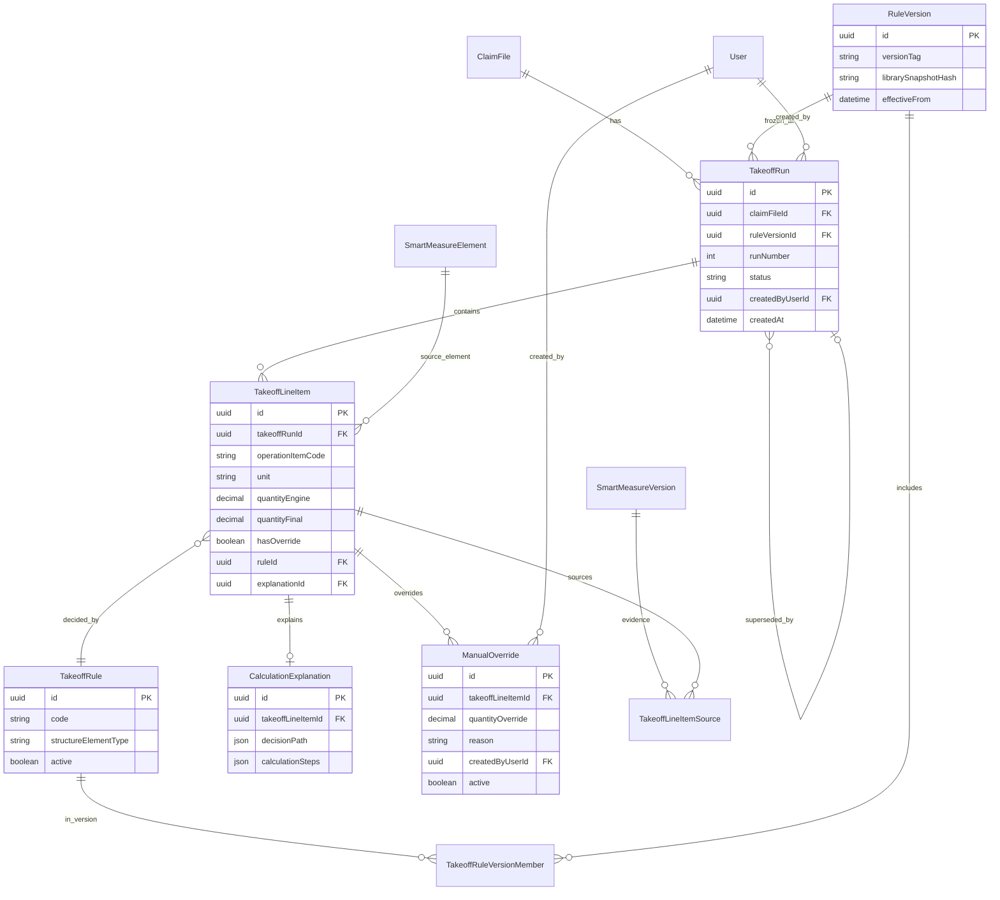

# Faz 2 — Smart Quantity Takeoff

# Mimari Tasarım

| Alan | Değer |
|------|--------|
| Doküman türü | Mimari Tasarım |
| Faz | **FAZ 2** |
| Modül | Smart Quantity Takeoff (Akıllı Metraj) |
| Durum | **ONAYLANDI / KİLİTLİ** (2026-08-02) |
| Tarih | 2026-08-02 |
| Bağlı BA | `SMART_QUANTITY_TAKEOFF_IS_ANALIZI.md` — **ONAYLI / KİLİTLİ** |
| Anayasa | `docs/project-governance/MERIDYEN_PLATFORM_PRENSIPLERI.md` |
| ADR Index | `docs/project-governance/ADR_INDEX.md` |
| Sonraki kapı | Implementation Plan onayı sonrası S1 ayrı talimat |
| Kısıt | Kod · migration · commit · branch · deploy **yok** |

**Çelişki kuralı:** Bu mimari, kilitli İş Analizi ile çelişen teknik karar alamaz.

**Bounded Context:** Smart Quantity Takeoff bağımsızdır.  
**Ölçü kaynağı:** Smart Measurement (salt okuma).  
**Değil:** Field Survey · CRM · Finans · Dashboard · Layout · Auth · Storage.

**UI dili:** Operasyon dili (Metraj, İş Kalemi, Hesaplama Açıklaması…). Teknik motor adları UI’ya yansımaz.

---

# 1. Domain Tasarımı

## 1.1 Kavramsal zincir (BA zorunlu)

```
Ölçü (Smart Measurement)
  ↓
Metraj (ara çıktı)
  ↓
Operasyon İş Kalemi
  ↓
Operasyon Süreci (genişleme / sonraki fazlar)
```

## 1.2 Aggregate ve varlıklar

### TakeoffRun (Aggregate Root)

Bir ClaimFile üzerinde, belirli bir **RuleVersion** ile üretilmiş koşum.

| Alan (mantıksal) | Açıklama |
|------------------|----------|
| id | UUID |
| claimFileId | Dosya bağlamı |
| ruleVersionId | Koşum anındaki kural sürümü (kalıcı) |
| status | draft \| active \| superseded \| archived |
| runNumber | Dosya içi artan koşum no (Takeoff/Run Version) |
| createdByUserId | Kim |
| createdAt | Ne zaman |
| note | Opsiyonel |
| supersededByRunId | Bilinçli yeniden koşumda önceki bağ |

**Değişmezlik:** `ruleVersionId` oluşturulduktan sonra değişmez.  
Eski run yeni kurallarla otomatik yeniden hesaplanmaz.

### TakeoffLineItem

Bir run içindeki **Operasyon İş Kalemi** satırı.

| Alan | Açıklama |
|------|----------|
| id | UUID |
| takeoffRunId | FK |
| operationItemCode | Örn. DOOR_PRIMER, DOOR_PAINT_COAT |
| displayName | Operasyon dili ad (UI) |
| structureElementType | Yapı elemanı tipi (kapı, tavan…) |
| sourceMeasureElementId | SM element |
| sourceMeasureVersionIds | SM version id listesi (kanıt) |
| unit | m2 \| m_tul \| adet \| … |
| quantityEngine | Decision+Calculation sonrası motor miktarı (**silinmez**) |
| quantityFinal | Override yoksa = engine; varsa override miktarı |
| hasOverride | bool |
| ruleId | Kararı üreten kural |
| ruleVersionId | Denormalize / doğrulama (run ile aynı olmalı) |
| metrajSnapshot | Ara metraj değerleri (JSON: areaM2, perimeterM vb.) |
| explanationId | CalculationExplanation FK |
| sortOrder | Gösterim sırası |
| status | active \| void |

### TakeoffRule

Rule Library üyesi tek kural tanımı (mantıksal kimlik; sürümleri RuleVersion taşır).

| Alan | Açıklama |
|------|----------|
| id | UUID |
| code | Stabil kod (DOOR_PAINTING_SET) |
| name | Operasyon adı |
| structureElementType | Eşleşecek yapı elemanı |
| active | Katalogda görünür mü |
| decisionSpec | Hangi iş kalemleri üretilir (kalem şablonları) |
| calculationBindings | Her kalem için hangi Calculation stratejisi + parametreler |

### RuleLibrary

Kuralların merkezi kataloğu (ürün kavramı + teknik registry).

- Yeni yapı elemanı, yeni iş kalemi, yeni kural **yalnızca Library üzerinden** eklenir.
- Runtime’da Rule Registry bu kataloğu okur.
- Faz 5 Onarım Bilgi Kütüphanesi ileride aynı katalog omurgasına içerik besleyebilir (şimdi birleşmez).

### RuleVersion

Belirli bir anda dondurulmuş kural seti sürümü.

| Alan | Açıklama |
|------|----------|
| id | UUID |
| versionTag | Örn. 2026.08.02.1 |
| librarySnapshotRef | O sürümdeki kural seti özeti / hash |
| effectiveFrom | Geçerlilik |
| createdBy / createdAt | Audit |
| notes | Değişiklik notu |

TakeoffRun → RuleVersion: **N:1**, zorunlu, immutable bağ.

### ManualOverride

Motor sonucundan ayrı katman.

| Alan | Açıklama |
|------|----------|
| id | UUID |
| takeoffLineItemId | FK |
| quantityEnginePreserved | Motor miktarının kopyası (garanti) |
| quantityOverride | Kullanıcı miktarı |
| reason | Zorunlu sebep |
| createdByUserId | Kim |
| createdAt | Ne zaman |
| active | Son override mu |

**Kural:** `quantityEngine` line item üzerinde asla silinmez/ezilmez. Override ayrı kayıt + `quantityFinal` projeksiyonu.

### CalculationExplanation

Explainable Calculation kaydı.

| Alan | Açıklama |
|------|----------|
| id | UUID |
| takeoffLineItemId | FK |
| measureSummary | Örn. 2100×900 mm |
| ruleCode / ruleVersionTag | Hangi kural + versiyon |
| decisionPath | Decision Engine adımları (neden bu kalemler) |
| calculationSteps | Calculation Engine adımları (alan, çarpan, fire…) |
| overrideSummary | Varsa override özeti |
| humanReadableText | Operasyon dili kısa özet |

## 1.3 İlişki özeti

```
ClaimFile 1──* TakeoffRun
RuleVersion 1──* TakeoffRun
TakeoffRun 1──* TakeoffLineItem
TakeoffRule (Library) ──<sürekli>── RuleVersion (snapshot üyeliği)
TakeoffLineItem 1──0..1 CalculationExplanation
TakeoffLineItem 1──* ManualOverride (active tek olabilir)
TakeoffLineItem *──* SmartMeasureVersion (kanıt; SM BC, salt okuma)
```

---

# 2. ER Diyagramı



---

# 3. Prisma Veri Modeli (tasarım — migration yok)

> Aşağısı **tasarım sözleşmesi**dir. Bu aşamada `schema.prisma` / migration dosyası **oluşturulmaz**.

```prisma
// === TASARIM ONLY — uygulamaya geçilmeden yazılmaz ===

enum TakeoffRunStatus {
  draft
  active
  superseded
  archived
}

enum TakeoffLineItemStatus {
  active
  void
}

model TakeoffRun {
  id               String   @id @default(uuid())
  claimFileId      String
  ruleVersionId    String
  runNumber        Int
  status           TakeoffRunStatus @default(active)
  note             String?
  createdByUserId  String
  createdAt        DateTime @default(now())
  supersededByRunId String?

  ruleVersion      RuleVersion @relation(fields: [ruleVersionId], references: [id])
  lineItems        TakeoffLineItem[]

  @@unique([claimFileId, runNumber])
  @@index([claimFileId, status])
  @@map("takeoff_runs")
}

model TakeoffLineItem {
  id                      String   @id @default(uuid())
  takeoffRunId            String
  operationItemCode       String
  displayName             String
  structureElementType    String
  sourceMeasureElementId  String?
  unit                    String
  quantityEngine          Decimal  @db.Decimal(18, 4)
  quantityFinal           Decimal  @db.Decimal(18, 4)
  hasOverride             Boolean  @default(false)
  ruleId                  String
  ruleVersionId           String
  metrajSnapshotJson      Json?
  sortOrder               Int      @default(0)
  status                  TakeoffLineItemStatus @default(active)

  run                     TakeoffRun @relation(fields: [takeoffRunId], references: [id])
  explanation             CalculationExplanation?
  overrides               ManualOverride[]
  sources                 TakeoffLineItemSource[]

  @@index([takeoffRunId])
  @@map("takeoff_line_items")
}

model TakeoffLineItemSource {
  id                      String @id @default(uuid())
  takeoffLineItemId       String
  smartMeasureVersionId   String
  // SM BC — FK opsiyonel/gevşek tutulabilir; erişim SM servisi üzerinden

  lineItem                TakeoffLineItem @relation(fields: [takeoffLineItemId], references: [id])
  @@index([smartMeasureVersionId])
  @@map("takeoff_line_item_sources")
}

model TakeoffRule {
  id                   String  @id @default(uuid())
  code                 String  @unique
  name                 String
  structureElementType String
  active               Boolean @default(true)
  decisionSpecJson     Json
  calculationBindJson  Json

  @@index([structureElementType, active])
  @@map("takeoff_rules")
}

model RuleVersion {
  id                   String   @id @default(uuid())
  versionTag           String   @unique
  librarySnapshotHash  String
  effectiveFrom        DateTime
  createdByUserId      String
  createdAt            DateTime @default(now())
  notes                String?

  runs                 TakeoffRun[]
  members              TakeoffRuleVersionMember[]

  @@map("takeoff_rule_versions")
}

model TakeoffRuleVersionMember {
  id            String @id @default(uuid())
  ruleVersionId String
  ruleId        String
  ruleBodyJson  Json   // o sürümde dondurulmuş kural gövdesi

  ruleVersion   RuleVersion @relation(fields: [ruleVersionId], references: [id])
  @@unique([ruleVersionId, ruleId])
  @@map("takeoff_rule_version_members")
}

model ManualOverride {
  id                       String   @id @default(uuid())
  takeoffLineItemId        String
  quantityEnginePreserved  Decimal  @db.Decimal(18, 4)
  quantityOverride         Decimal  @db.Decimal(18, 4)
  reason                   String
  createdByUserId          String
  createdAt                DateTime @default(now())
  active                   Boolean  @default(true)

  lineItem                 TakeoffLineItem @relation(fields: [takeoffLineItemId], references: [id])
  @@index([takeoffLineItemId, active])
  @@map("takeoff_manual_overrides")
}

model CalculationExplanation {
  id                 String @id @default(uuid())
  takeoffLineItemId  String @unique
  measureSummary     String
  ruleCode           String
  ruleVersionTag     String
  decisionPathJson   Json
  calculationStepsJson Json
  overrideSummaryJson Json?
  humanReadableText  String

  lineItem           TakeoffLineItem @relation(fields: [takeoffLineItemId], references: [id])
  @@map("takeoff_calculation_explanations")
}
```

**Not:** Rule Library “içerik yönetimi” v1’de seed + kod registry ile başlayabilir; DB tabloları yukarıdaki omurgayı bozmadan doldurulur.

---

# 4. API Tasarımı

**Base:** `/api/v1/claim-files/:claimFileId/smart-takeoff`  
**Auth:** Bearer JWT (mevcut panel auth).  
**Tenant / erişim:** Her istekte ClaimFile erişimi — SM ile aynı çizgi (`ClaimFilesService.findOne` → `assertClaimFileAccess`).

| Method | Path | Amaç | Authz |
|--------|------|------|-------|
| GET | `/` | Dosyanın run listesi (özet) | claim okuma |
| POST | `/runs` | Yeni TakeoffRun üret (pipeline) | claim güncelleme / takeoff izni |
| GET | `/runs/:runId` | Run + line items + explanation özeti | claim okuma |
| GET | `/runs/:runId/line-items/:itemId` | Tek kalem + full explanation | claim okuma |
| POST | `/runs/:runId/line-items/:itemId/override` | Manual override | claim güncelleme |
| DELETE | `/runs/:runId/line-items/:itemId/override` | Active override kaldır (motor final’a döner) | claim güncelleme |
| GET | `/runs/:runId/pdf` | PDF (onaylı alt sürümde) | claim okuma |
| GET | `/rule-versions/current` | Aktif RuleVersion bilgisi (admin/ops) | yetkili rol |

### Request — POST `/runs`

```json
{
  "note": "opsiyonel",
  "measureElementIds": ["uuid..."] 
}
```

`measureElementIds` boşsa: dosyadaki uygun SM elementlerinin tamamı (kural eşleşenler).

### Response — 201 Run

```json
{
  "data": {
    "id": "run-uuid",
    "runNumber": 2,
    "ruleVersionTag": "2026.08.02.1",
    "status": "active",
    "lineItems": [
      {
        "id": "item-uuid",
        "displayName": "Kapı — Astar",
        "unit": "m2",
        "quantityEngine": 1.89,
        "quantityFinal": 1.89,
        "hasOverride": false,
        "structureElementType": "door"
      }
    ]
  }
}
```

### Request — POST override

```json
{
  "quantityOverride": 2.10,
  "reason": "Saha ölçüsünde pervaz dahil edildi"
}
```

### Status kodları

| Kod | Anlam |
|-----|--------|
| 200 / 201 | Başarılı |
| 400 | Doğrulama / eksik ölçü / sebep yok |
| 401 | Token yok |
| 403 | ClaimFile / permission yok |
| 404 | Run/item yok veya tenant dışı |
| 409 | Çakışma (örn. superseded run’a yazma) |
| 422 | Kural yok / hesaplanamaz (sessiz uydurma yok) |

### Authorization özeti

- Permission adayları (mimari isim; seed uygulama aşamasında): `smart_takeoff.read`, `smart_takeoff.run`, `smart_takeoff.override`  
- Yoksa geçici: `claim_file.read` / `claim_file.update` ile hizalama (ürün onayı ile).  
- Rol: ofis / yetkili saha; finans rolleri v1’de zorunlu değil.

---

# 5. Rule Engine Tasarımı

Rule Engine, **Calculation Engine değildir**.  
Rule Engine = orkestrasyon + **Decision Engine** + Rule Library erişimi + version çözümleme.

## 5.1 Bileşenler

| Bileşen | Görev |
|---------|--------|
| **Rule Registry** | Library’deki kural tanımlarını yükler (kod/seed/DB) |
| **Rule Version Resolver** | Run için dondurulacak / kullanılacak RuleVersion’ı seçer |
| **Rule Resolver** | Yapı elemanı (+ bağlam) → aday kurallar (o Version içinden) |
| **Decision Engine** | Hangi Operasyon İş Kalemleri üretilir? (matematik değil) |
| **Calculation Engine** | Alan, çevre, çarpan, fire… (kalem kararı vermez) |
| **Rule Executor** | Decision + Calculation’ı kalem bazında çalıştırır; Explanation üretir |

## 5.2 Strategy Pattern

```
MeasureAdapter (SM okuma)
    ↓
ElementClassifier → structureElementType
    ↓
RuleVersionResolver → RuleVersion
    ↓
RuleResolver → TakeoffRule[]
    ↓
DecisionEngine (strategy per rule family) → OperationItemPlan[]
    ↓
CalculationEngine (strategy: Area, Perimeter, Volume, Multiplier, Waste…)
    ↓
LineItemMaterializer + ExplanationBuilder
    ↓
Persistence (Run + Items + Explanations)
```

**Strategy örnekleri (Calculation):** `AreaFromWxH`, `PerimeterMinusDoors`, `ApplyCoatsMultiplier`, `ApplyWastePercent`.  
**Strategy örnekleri (Decision):** `DoorPaintingDecision`, `WallPaintDecision`, `SkirtingDecision`.

---

# 6. Calculation Engine Tasarımı

**Sorumluluk sınırı (zorunlu):**

- Yalnız matematiksel / geometrik hesap.  
- **Asla** hangi operasyon kaleminin oluşacağına karar vermez.

| Operasyon | Örnek |
|-----------|--------|
| Alan | 2100×900 mm → 1,89 m² |
| Çevre | oda çevresi − kapı düşümü |
| Hacim | (genişleme) |
| Çarpan | 2 kat boya → ×2 |
| Fire | %8 fire |

Girdi: sayısal ölçüler + parametreler (RuleVersion’dan).  
Çıktı: sayı + `calculationSteps[]`.

---

# 7. Decision Engine Tasarımı

**Sorumluluk sınırı (zorunlu):**

- Hesaplanan / ham ölçülerden **hangi Operasyon İş Kalemlerinin** üretileceğine karar verir.  
- Bu karar operasyon kuralıdır; matematik değildir.

Örnek:

```
Kapı ölçüsü
  ↓ Decision (Rule Library: Kapı Boyama ailesi)
  → Macun
  → Astar
  → Zımpara
  → Son Kat Boya
  → (kat bazlı boya kalemleri)
```

Her planlanan kalem için Calculation Engine’e binding gönderilir.  
Decision Engine, Rule Library + RuleVersion ile çalışır; Calculation Engine’den **bağımsız** modüldür.

---

# 8. Calculation Pipeline

```
Ölçü (SM)
  ↓
Yapı Elemanı
  ↓
Rule Library
  ↓
Rule Version (dondur / bağla)
  ↓
Decision Engine          ← iş kalemleri kararı
  ↓
Calculation Engine       ← sayısal hesap
  ↓
Operasyon İş Kalemi (quantityEngine)
  ↓
Manual Override (ops.)   ← quantityFinal
  ↓
Evidence (SM version + explanation)
  ↓
Audit (run create / override)
```

**Metraj:** Pipeline içinde ara snapshot (`metrajSnapshotJson`); UI’da “ara metraj” olarak gösterilebilir; nihai liste iş kalemleridir.

---

# 9. Explainable Calculation Tasarımı

Her Operasyon İş Kalemi için saklanır:

| Bilgi | Depolama |
|-------|----------|
| Hangi ölçü | `sources[]` + `measureSummary` |
| Hangi kural | `ruleCode` / `ruleId` |
| Hangi formül / adımlar | `calculationStepsJson` |
| Hangi Decision yolu | `decisionPathJson` |
| Hangi Rule Version | `ruleVersionTag` |
| Hangi override | `overrideSummaryJson` + ManualOverride kaydı |

**Örnek explanation (içerik):**

```
Kapı → 2100×900 mm → alan 1,89 m²
Decision: Kapı Boyama seti → kalem "Boya (2 kat)"
Calculation: 1,89 × 2 = 3,78 m²
RuleVersion: 2026.08.02.1
Override: yok
```

UI etiketi: **Hesaplama Açıklaması** (teknik sınıf adı gösterilmez).

---

# 10. Manual Override Tasarımı

```
quantityEngine  (immutable after create)
       ↓
ManualOverride  (ayrı satır; reason zorunlu)
       ↓
quantityFinal   (projeksiyon)
       ↓
AuditLog / override kaydı
```

| Kural | Uygulama |
|-------|----------|
| AI/motor sonucu korunur | `quantityEngine` + `quantityEnginePreserved` |
| Override ayrı katman | `ManualOverride` tablosu |
| Audit bozulmaz | kim, ne zaman, sebep |
| Evidence Chain bozulmaz | SM source id’ler silinmez; explanation güncellenir (override özeti eklenir) |
| Override kaldırma | active=false; final←engine |

---

# 11. Rule Library Tasarımı

**Tek genişleme kapısı.**

| Eklemek istenen | Nereden |
|----------------|---------|
| Yeni kural | Rule Library + yeni/güncel RuleVersion |
| Yeni yapı elemanı tipi | Library’de elementType + Decision stratejisi kaydı |
| Yeni iş kalemi kodu | `decisionSpec` içinde operationItemCode |

Runtime kodda dağınık `if (type===...)` yığını **anti-pattern**; Resolver + Registry zorunlu.

v1 içerik: BA’daki 12 eleman omurgası + kapı çoklu kalem örneği.  
Library örnek aileleri (BA): Kapı Boyama, PVC/Lake/Metal/Ahşap Boyama, Yangın Kapısı, Cam Bölme, Asma Tavan, Alçıpan, Parke, Seramik…

---

# 12. Versioning

| Kavram | Anlam |
|--------|--------|
| **Rule Version** | Kural setinin dondurulmuş sürümü; Run’a zorunlu bağ |
| **Takeoff / Run Version** | Aynı dosyada `runNumber` ile artan koşumlar; önceki `superseded` |
| **Line immutability** | Motor alanları run içinde yeniden yazılmaz; yeni run veya override |

**Otomatik recompute yasak:** RuleVersion yükseltmesi eski run’ları değiştirmez.  
Bilinçli yeniden üretim → yeni TakeoffRun + yeni/aktif RuleVersion.

---

# 13. UI Akışı

```
Hasar Dosyası
  ↓
Akıllı Ölçüm          (SM — mevcut)
  ↓
Akıllı Metraj         (bu modül girişi — Raporlar veya Operasyon altı; ince mount)
  ↓
Operasyon İş Kalemleri
  ↓
Hesaplama Açıklaması  (kalem detay)
  ↓
PDF                   (alt sürüm)
```

**UI’da görünmez:** Rule Engine, Decision Engine, Calculation Engine, Strategy, Registry, API.  
**UI’da görünür:** Metraj, İş Kalemi, Miktar, Birim, Hesaplama Açıklaması, Düzeltme (override), Sebep.

Override UX: miktar düzenle → sebep zorunlu → kaydet; motor değeri “sistem hesabı” olarak salt okunur gösterilir.

---

# 14. Yetkilendirme Modeli

| Katman | Kural |
|--------|--------|
| **Tenant** | Mevcut org/tenant izolasyonu; ClaimFile dışı veri yok |
| **ClaimFile** | Her endpoint’te `assertClaimFileAccess` |
| **Permission** | read / run / override (veya claim_file eşlemesi) |
| **Role** | Ofis dosya sorumlusu birincil; saha okuma/üretim ürün kararına bağlı |
| **SM** | Yalnız SM read API / servis; SM yazma yok |
| **Cross-module** | CRM/Finans/Dashboard/Layout/Auth/Storage’a çağrı yok |

---

# 15. Performans

| Konu | Karar |
|------|--------|
| Determinizm | Aynı SM snapshot + aynı RuleVersion → aynı `quantityEngine` |
| Caching | RuleVersion snapshot bellek cache (process içi); ölçü verisi run anında okunur, uzun TTL cache zorunlu değil |
| Yeniden koşum | Kullanıcı tetikli; arka plan toplu job yok (v1) |
| PDF | Lazy; run persist sonrası üretilir |
| Boyut | Tipik &lt;100 element / &lt;500 line item — senkron HTTP kabul |

---

# 16. Genişleyebilirlik Raporu

| Faz | Doğal oturma noktası |
|-----|----------------------|
| **Faz 3 — Tedarikçi Hafızası** | `operationItemCode` + miktar/birim → tedarikçi performans ve kapasite bağları |
| **Faz 4 — Digital Twin** | `sourceMeasure*` + line item id → 3D eleman kimliği |
| **Faz 5 — Onarım Bilgi Kütüphanesi** | Rule Library içeriğini standart iş akışı / kalite adımları ile besler |

**Yeniden yazım yasağı ilkesi:** Decision/Calculation ayrımı, RuleVersion, Explanation, Override katmanı korunarak büyür; monolith if-else veya SM’ye yazma yoktur.

Genişleme başlıkları (BA §15): Yeni Yapı Elemanları · İş Kalemleri · Ölçü Türleri · Hesaplama Kuralları · Çıktı Türleri → hepsi Library + Strategy ile.

---

# 17. Risk Analizi (mimari)

| Risk | Azaltma |
|------|---------|
| Decision ile Calculation’ın karışması | Ayrı modüller, ayrı strategy hiyerarşisi, kod review kapısı |
| SM’ye yazma / şema sızıntısı | BC sınırı + yalnızca read port |
| Field Survey birleşimi | Mimari yasak |
| Sessiz recompute | RuleVersion immutable bağ |
| Override’ın engine’i ezmesi | Ayrı tablo + quantityEngine immutable |
| UI’da teknik dil | Metin sözlüğü / Title Case operasyon dili |
| Erken Faz 3–5 implementasyonu | Yalnız port/extension noktaları; kod yok |
| page.tsx şişmesi | İnce mount bileşeni |

---

# 18. Mimari Karar Özeti (ADR kısa)

| ID | Karar |
|----|--------|
| ADR-01 | SQT bağımsız Bounded Context |
| ADR-02 | SM salt okuma ölçü kaynağı |
| ADR-03 | Metraj ara çıktı; nihai = Operasyon İş Kalemi |
| ADR-04 | **Decision Engine ⊥ Calculation Engine** (zorunlu) |
| ADR-05 | Rule Library ⊥ Rule Engine orkestrasyonu; içerik Library’de |
| ADR-06 | Her Run → bir RuleVersion (kalıcı) |
| ADR-07 | Explainable Calculation zorunlu bileşen |
| ADR-08 | Manual Override ayrı katman; Evidence bozulmaz |
| ADR-09 | Otomatik recompute yok |
| ADR-10 | CRM/Finans/Dashboard/Layout/Auth/Storage/Field Survey dokunulmaz |
| ADR-11 | UI tamamen operasyon dili |
| ADR-12 | Faz 3/4/5 için extension noktaları; şimdi uygulama yok |
| ADR-13 | Business Knowledge Layer — kavramsal üst katman; bugün implement yok (§19.1) |
| ADR-14 | Learning Ready Architecture — öğrenmeye engel olmayan ilişkiler; ML yok (§19.2) |
| ADR-15 | Operation Intelligence — iş kalemi ileriki modüllere hazır (§19.3) |
| ADR-16 | Rule Independence — kural gömülü backend yok (§19.4) |
| ADR-17 | Product Independence — yeniden kullanılabilir BC; domain dili Meridyen (§19.5) |
| ADR-18 | Operation Knowledge First (§19.7 / Plan §13.1) |
| ADR-19 | Digital Twin Ready — model kimlikleri (§19.8) |
| ADR-20 | Operational Graph Ready (§19.9) |
| ADR-21 | Future AI Ready — AI öneri katmanı, SSOT değil (§19.10) |
| ADR-22 | Business Capability First — ONAYLI (§19.12 / Plan §14.1) |
| ADR-23 | Product Memory — ONAYLI (§19.13 / Plan §14.2) |
| ADR-24 | One Source of Operational Truth — ONAYLI (§19.14 / Plan §14.3) |
| ADR-25 | Operation Intelligence Vision — ONAYLI (§19.15 / Plan §14.4) |
| ADR-26 | Knowledge Reusability — ONAYLI (§19.16 / Plan §14.5) |
| ADR-27 | Capability Lifecycle — Production son değil (§19.17 / Plan §14.6) |
| ADR-28 | Learning Loop (§19.18 / Plan §14.7) |
| ADR-29 | Platform Knowledge (§19.19 / Plan §14.8) |
| ADR-30 | Continuous Improvement (§19.20 / Plan §14.9) |
| ADR-31 | Resmi ürün vizyonu cümlesi (§19.21 / Plan §14.10) |
| ADR-32 | Capability Ecosystem (§19.22 / Plan §14.12) |
| ADR-33 | Capability Maturity Model L1–L6 (§19.23 / Plan §14.13) |
| ADR-34 | MERIDYEN_PLATFORM_PRENSIPLERI anayasa belgesi (§19.24) |
| ADR-35 | Methodology Stability — STABLE; odak ürün (Anayasa §0) |
| ADR-36 | Product Research First (Anayasa §0.4) |
| ADR-37 | Product Discovery Report (Anayasa §0.5) |
| ADR-38 | BUILD MODE — ürün geliştirme düzeni (Anayasa §0.6) |
| ADR-39 | Reusable Platform First (Anayasa §0.7) |

> Tam indeks: `docs/project-governance/ADR_INDEX.md`

---

# 19. Stratejik Mimari Prensipler (referans — implementation kapsamı dışı)

> Aşağıdaki prensipler **onaylı mimariye referans** olarak eklenmiştir.  
> **Bugün implement edilmez.** Faz 2 v1 kod kapsamına alınmaz.  
> Amaç: gelecekteki yönü sabitlemek; mevcut Decision / Calculation / Rule Library omurgasını bozmamak.

## 19.1 Business Knowledge Layer

Calculation Engine · Decision Engine · Rule Library katmanlarının **üzerinde** kavramsal bir üst katman tanımlanır:

**Business Knowledge Layer**

Bu katman (gelecekte) bir araya getirir:

- iş kurallarını,
- kurumsal operasyon bilgisini,
- onarım tecrübelerini,
- tedarikçi öğrenmelerini,
- uzman operasyon bilgisini.

```
Business Knowledge Layer          ← kavramsal; bugün implement yok
        ↓ besler / okur (ileride)
Rule Library · Decision Engine · Calculation Engine
        ↓
Operasyon İş Kalemi · Explanation · Evidence
```

Faz 5 Onarım Bilgi Kütüphanesi bu katmana doğal içerik kaynağı olabilir.  
**Şimdi:** yalnız yön tanımı; servis/tablo/API yok.

## 19.2 Learning Ready Architecture

Mimari, gelecekte sistemin öğrenebilmesine **engel olmayacak** şekilde ilişki kurar.

Tekrarlayan örüntüler (aynı operasyon · aynı yapı elemanı · aynı hasar tipi · aynı onarım yöntemi) ileride öneri üretebilecek kimliklerle saklanır:

- stabil `operationItemCode`
- `structureElementType`
- ClaimFile / hasar bağlamı referansları (okuma)
- RuleVersion + Explanation (gelen kararın izi)
- Override audit (insan düzeltmesi sinyali)

**Bu aşamada makine öğrenmesi geliştirilmez.**  
Yalnızca veri modeli ve kimlikler öğrenme yolunu kapatmaz.

## 19.3 Operation Intelligence

Her Operasyon İş Kalemi, ileride şu modüller tarafından kullanılabilir şekilde tasarlanır:

- Tedarikçi Hafızası (Faz 3)
- 3D Dijital İkiz (Faz 4)
- Onarım Bilgi Kütüphanesi (Faz 5)
- Operasyon Analitiği
- AI Destekli Operasyon Asistanı

**Bugün bu modüller geliştirilmez.**  
Veri modeli ve ilişkiler (`operationItemCode`, miktar, birim, ölçü kanıtı, rule version) geleceğe engel olmaz.

## 19.4 Rule Independence

Hiçbir operasyon kuralı backend koduna **gömülü** tasarlanmaz.

Kurallar yönetilir:

- Rule Library
- Rule Version
- Decision Engine

**Sonuç:** Yeni iş kalemi eklemek, mevcut uygulama kodunu değiştirmek zorunda bırakmamalıdır (yeni Library kaydı + gerekirse yeni Strategy kaydı / Version).  
Dağınık `if (elementType === ...)` anti-pattern’dir.

## 19.5 Product Independence

Smart Quantity Takeoff ileride:

- başka ürünlerde,
- başka sektörlerde,
- başka operasyon süreçlerinde

yeniden kullanılabilecek **Bounded Context** olarak tasarlanır.

| Katman | Dil |
|--------|-----|
| Ürün / UI / domain dili | **Meridyen** operasyon dili |
| Teknik mimari | Yeniden kullanılabilir (port/adapter, Library, Engine ayrımı) |

Meridyen dışı kullanım bugünün kapsamı değildir; mimari kilidi yeniden yazımı zorlamaz.

## 19.6 Insurance Knowledge Platform (referans)

SQT, Meridyen’in gelecekteki **Kurumsal Sigorta Bilgi Platformu** çekirdeğine katkı verir.  
Rule / Decision / Calculation omurgası; Supplier Intelligence, Digital Twin, Repair Knowledge Library, Operation Intelligence ve AI Recommendation Engine tarafından yeniden kullanılabilir kimlikler bırakır.  

**Bugün implement edilmez.** Tek sprint çözümleri için kural gömmek yasaktır (Implementation Plan §11.10 / §12.1 / §13).

## 19.7 Operation Knowledge First (referans)

Her özellik: “Bu geliştirme platformun operasyon bilgisini artırıyor mu?”  
HAYIR → çözüm yeniden değerlendirilir. Meridyen metraj yazılımı değil; operasyon bilgi platformudur.  
(Detay: Implementation Plan §13.1)

## 19.8 Digital Twin Ready (referans)

3D Dijital İkiz bugün yok. Domain kimlikleri ileride kroki / oda / hasar bölgesi / operasyon noktası / 3D model bağlarına açık tutulur.  
Ekran-içi tek kullanımlık modeller tercih edilmez. (Plan §13.7)

## 19.9 Operational Graph Ready (referans)

ClaimFile → … → Operasyon İş Kalemi → Tedarikçi → Malzeme → Fatura → Garanti ilişkileri ileride kurulabilir olmalı.  
Graph runtime bugün yok; FK/kimlik kararları bunu engellemez. (Plan §13.8)

## 19.10 Future AI Ready (referans)

Deterministik Rule / Decision / Calculation birincil doğruluk kaynağıdır.  
AI yalnızca ileride öneri katmanı; Decision/Calculation ile birleştirilmez, tek SSOT olmaz. (Plan §13.9)

## 19.11 Engine ayrımı (teyit — kalıcı)

| Motor | Yapar | Yapmaz |
|-------|--------|--------|
| Calculation Engine | Alan, çevre, hacim, çarpan, fire | İş kalemi, operasyon kararı, tedarikçi, iş akışı |
| Decision Engine | Operasyon İş Kalemi planı (ve ileride öneri türleri) | Geometri/matematik; Calculation ile birleşme |
| Rule Library | Operasyon bilgisi + standart + kanıt + explanation bağları | Feature içine gömülü if-zinciri |

(Plan §13.2–13.4)

## 19.12 Business Capability First — ONAYLI (2026-08-02)

Büyüme birimi = **Business Capability**, ekran/modül yığını değil.  
Her Capability: Domain · API · Rule Library · Decision · yaşam döngüsü.  
SQT Capability adı (iş dili): **Operasyon Metrajı Üretebilme**.  
Geliştirme öncesi: *Platforma hangi yeni Business Capability kazandırılıyor?*  
(Plan §14.1)

## 19.13 Product Memory — ONAYLI (2026-08-02)

Capability’ler kurallar, hesaplar, kararlar, başarı sinyalleri ve süreç değişimini platform ortak bilgisine biriktirir.  
İzole modül bilgisi yok; yeni Capability’ler önceki Capability’lerden beslenir.  
(Plan §14.2 — UI’da teknik “hafıza” markası yok.)

## 19.14 One Source of Operational Truth — ONAYLI (2026-08-02)

Rule · Operation Item · Structure Element · Supplier Knowledge · Decision → **tek doğruluk kaynağı**.  
Kopya tanım yasak. Repository SSOT’un iş kuralı düzeyindeki karşılığı.  
(Plan §14.3)

## 19.15 Operation Intelligence Vision — ONAYLI (2026-08-02)

Tüm Capability’ler gelecekteki Operation Intelligence katmanına hizmet edecek bilgi üretir; yalnız kendi problemini çözmek için izole tasarlanmaz.  
OI ürünü bugün implement edilmez. (Plan §14.4)

## 19.16 Knowledge Reusability — ONAYLI (2026-08-02)

Rule ve operasyon bilgisi tek kullanımlık değildir; Supplier Memory · Digital Twin · Repair Knowledge Library · Operation Intelligence · AI Recommendation Engine tarafından yeniden kullanılabilir tasarlanır.  
(Plan §14.5)

## 19.17 Capability Lifecycle — ONAYLI (2026-08-02)

IDEA → … → PRODUCTION → LEARNING → OPTIMIZATION → PLATFORM KNOWLEDGE.  
Production son adım değildir; öğrenme platforma geri döner.  
(Plan §14.6)

## 19.18 Learning Loop — ONAYLI (2026-08-02)

Canlı kullanım sonrası: operasyon / kullanıcı / sistem / Rule Library / platform bilgisi soruları → sonraki Capability girdileri.  
(Plan §14.7)

## 19.19 Platform Knowledge — ONAYLI (2026-08-02)

Tamamlanan Capability ortak bilgi katmanını büyütür; yeni Capability’ler üzerine inşa edilir. Bilgi yeniden üretilmez, yeniden kullanılır.  
(Plan §14.8)

## 19.20 Continuous Improvement — ONAYLI (2026-08-02)

Capability bitmez; canlı kullanım, geri bildirim, Rule Library, (ileride) AI değerlendirme ve performans ile olgunlaşır.  
(Plan §14.9)

## 19.21 Ürün vizyonu (referans cümle) — ONAYLI

> Meridyen, her tamamlanan Capability ile yalnızca yeni bir özellik kazanmaz; aynı zamanda operasyon bilgisini büyüten, karar kalitesini artıran ve gelecekteki tüm Capability’leri güçlendiren kurumsal bir operasyon bilgi platformudur.

(Plan §14.10 · Anayasa §1)

## 19.22 Capability Ecosystem — ONAYLI (2026-08-02)

Bağımsız Capability değerlendirmesi yok. Bilgi kazandır · mevcutları güçlendir · gelecek temeli ol.  
Üç soru kapısı zorunlu. (Plan §14.12 · Anayasa §4.1 · ADR-32)

## 19.23 Capability Maturity Model — ONAYLI (2026-08-02)

L1 Working → L2 Explainable → L3 Standardized → L4 Reusable → L5 Learning → L6 Intelligent.  
(Plan §14.13 · Anayasa §4.2 · ADR-33)

## 19.24 Anayasa belgesi — ONAYLI (2026-08-02)

Üst referans: `docs/project-governance/MERIDYEN_PLATFORM_PRENSIPLERI.md` (**STABLE**)  
ADR Index: `docs/project-governance/ADR_INDEX.md`  
Methodology Stability: Anayasa §0 · ADR-35  
Product Research First: Anayasa §0.4 · ADR-36  
Product Discovery Report: Anayasa §0.5 · ADR-37  
BUILD MODE: Anayasa §0.6 · ADR-38  
Reusable Platform First: Anayasa §0.7 · ADR-39  
(ADR-34)

---

# Teslim Kontrol Listesi

| Belge | Bu dokümanda |
|-------|----------------|
| Domain Tasarımı | §1 |
| ER Diyagramı | §2 |
| Prisma Veri Modeli | §3 |
| API Tasarımı | §4 |
| Rule Engine Tasarımı | §5 |
| Rule Library Tasarımı | §11 |
| Calculation Engine Tasarımı | §6 |
| Decision Engine Tasarımı | §7 |
| Calculation Pipeline | §8 |
| Explainable Calculation | §9 |
| Manual Override | §10 |
| Versioning | §12 |
| UI Akışı | §13 |
| Yetkilendirme Modeli | §14 |
| Performans | §15 |
| Genişleyebilirlik Raporu | §16 |
| Risk Analizi | §17 |
| Mimari Karar Özeti | §18 |
| Stratejik Prensipler (referans) | §19 (19.1–19.24) · Anayasa · ADR Index |

---

# Ürün Sahibi Onayı (Mimari)

```
Ürün sahibi: Mustafa
Karar: ONAY
Tarih: 2026-08-02
Not: Mimari kilitli. Stratejik prensipler (§19) referans. Sonraki kapı: Implementation Plan onayı.
```

| Sonraki | Belge |
|---------|--------|
| Implementation Plan | `SMART_QUANTITY_TAKEOFF_IMPLEMENTATION_PLAN.md` |
| Geliştirme | Plan onayı olmadan **başlamaz** |

**Teyit:** Kod yazılmadı · migration yok · commit yok · branch yok · deploy yok · implementation’a geçilmedi.
