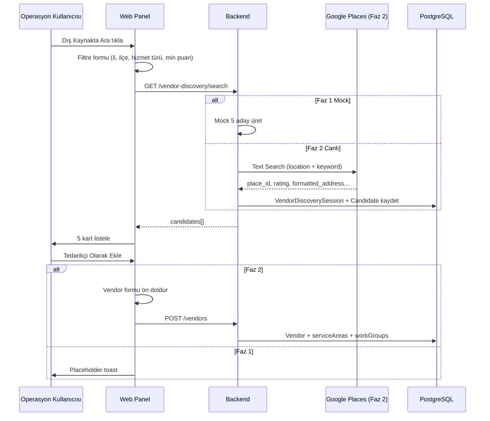

# Tedarikçi Dış Kaynak Arama — Hazırlık Planı

Tarih: 2026-07-02  
Durum: **Faz 3 (canlı)** — koordinat aktarımı, import bağlama, kota, test bağlantısı  
İlgili ekran: `/panel/tedarikciler`

---

## 1. Kullanıcı Hikayesi

**Operasyon yöneticisi olarak**, kayıtlı tedarikçi ağımda belirli bir il/ilçede ve hizmet türünde (ör. Muğla — camcı) yeterli kapasite bulamadığımda, **Google ve sosyal medya kaynaklarından** en uygun **ilk 5 adayı** hızlıca görmek ve seçtiklerimi Meridyen'e tedarikçi olarak eklemek istiyorum.

**İş sorunu:** Eksik tedarikçi ağı operasyonel darboğaz yaratıyor; dosya ataması gecikiyor, saha ekipleri manuel Google araması yapıyor, bilgi Meridyen'e aktarılmıyor.

**Meridyen prensibi (governance):** Tedarikçi önerisinde **sistem önerir, insan karar verir** — dış kaynak sonuçları otomatik kayıt oluşturmaz.

---

## 2. Mevcut Altyapı (Keşif Özeti)

| Alan | Mevcut durum |
|------|----------------|
| **Vendor modeli** | `Vendor` — adres, koordinat, `category`, `serviceBranches`, `VendorServiceArea`, `VendorWorkGroup` |
| **İç öneri** | `GET /vendors/suggest` — kayıtlı tedarikçilerden il + iş grubu ile skorlu öneri |
| **Konum** | `LocationsModule` — il/ilçe API; frontend `turkey-locations` statik veri |
| **Geocode** | OpenStreetMap Nominatim (`geocode-address.ts`) — Google Maps API **yok** |
| **Harita UI** | `LocationPickerModal` — Leaflet + Google Maps yönlendirme linki |
| **Entegrasyonlar** | Logo ERP, M365 Graph (gelen kutusu), Turmob/NVI — Places API yok |
| **UI kalıbı** | `SlidePanel`, `SearchableSelect`, Title Case (`toTitleCaseTR`) |
| **Önceki plan** | BACKLOG / governance'de bu özellik **henüz planlanmamış** |

---

## 3. MVP Kapsamı

### Faz 1 — Hazırlık / Mock (şimdi)

- Tedarikçiler sayfasında **Dış Kaynakta Ara** butonu
- Slide panel: il, ilçe, hizmet türü, min. puan filtreleri
- `GET /vendor-discovery/search` — **mock 5 sonuç**
- Sonuç kartları: ad, adres, puan, kaynak, harita linki
- **Tedarikçi Olarak Ekle** — placeholder (toast / Faz 2 notu)
- Teknik plan dokümanı + BACKLOG maddesi

### Faz 2 — Canlı API (tamamlandı)

- Google Places API (Text Search) entegrasyonu + mock fallback
- Sonuç → `Vendor` oluşturma akışı (ön doldurulmuş form)
- Arama oturumu kaydı (`VendorDiscoverySession` + `VendorDiscoveryCandidate`)
- Ayarlar ekranı: Entegrasyonlar → Google Places (API key + aktif toggle)
- Duplicate kontrolü mevcut akışta — dokunulmadı

### Faz 3 — İyileştirmeler (tamamlandı)

- Koordinat aktarımı: import prefill → tedarikçi formu harita konumu
- Import sonrası `importedVendorId` bağlama (`POST /vendor-discovery/link-import`)
- Günlük kota: kullanıcı başına 30 arama/gün (UTC), `GET /vendor-discovery/quota`
- Entegrasyonlar → Google Places **Bağlantıyı Test Et** (`POST /vendor-discovery/test-google`)
- Mock sonuçlara il merkezi offset koordinat (bilinen iller) veya null

### Faz 4 — Sonraki (planlanmadı)

- Org bazlı devre kesici
- Sosyal medya kaynakları (sınırlı)
- Dakika bazlı rate limit

### Kapsam dışı (Faz 1)

- Prisma migration / kalıcı aday tablosu
- Otomatik tedarikçi kaydı
- Canlı Google API çağrısı

---

## 4. API Seçenekleri Karşılaştırması

| Kaynak | Uygunluk | Artılar | Eksiler | Tahmini maliyet |
|--------|----------|---------|---------|-----------------|
| **Google Places API (New)** | ★★★★★ | Türkiye kapsamı geniş, puan/yorum, telefon, website | API key, kota, TOS (veriyi cache sınırları) | ~$17 / 1000 Text Search; aylık $200 ücretsiz kredi (GCP) |
| **Google Maps Geocoding** | ★★★ | Adres → koordinat | İşletme araması değil | Geocoding ayrı fiyatlandırma |
| **Yelp Fusion API** | ★★ | Puan/yorum zengin | Türkiye kapsamı zayıf | Ücretsiz tier sınırlı |
| **Foursquare Places** | ★★★ | POI verisi | TR'de Google kadar güçlü değil | Tier bazlı |
| **SerpAPI / Outscraper** | ★★★ | Google sonuçlarını scrape eder | Üçüncü taraf, TOS riski, ek maliyet | Abonelik |
| **Instagram / Facebook Graph** | ★★ | Sosyal varlık | İşletme arama API'si kapalı/sınırlı; onay süreci uzun | — |

**Öneri (Faz 2):** Birincil kaynak **Google Places API (New) — Text Search**; sosyal medya için yalnızca sonuç kartında harici link (Places `websiteUri` / manuel Instagram handle) — ayrı scrape yapılmaz.

---

## 5. Veri Akışı



---

## 6. Güvenlik ve API Key Yönetimi

- Google API key **yalnızca backend** ortam değişkeninde: `GOOGLE_PLACES_API_KEY`
- GCP konsol: API kısıtlaması (IP / referrer değil — sunucu IP veya VPC)
- Etkin API'ler: Places API (New) — gereksiz Maps JS API frontend'de açılmaz (maliyet)
- Kota: günlük limit + `SystemSettings` ile org bazlı devre kesici (Faz 2)
- Arama logları: kullanıcı id, sorgu parametreleri, sonuç sayısı — KVKK için kişisel veri taşımaz
- Rate limit: kullanıcı başına dakikada N arama (Faz 2)

---

## 7. UI Akışı

**Giriş noktası:** `/panel/tedarikciler` — sayfa başlığı yanında **Dış Kaynakta Ara** (birincil değil, ikincil buton — `btn-secondary`).

**Panel (SlidePanel, ~520px):**

1. **Filtreler**
   - İl (SearchableSelect)
   - İlçe (opsiyonel)
   - Hizmet türü (serbest metin — örn. Camcı, Sıvacı)
   - Min. puan (3.0 – 5.0 slider veya select)
2. **Ara** butonu
3. **Sonuç listesi** — en fazla 5 kart
   - İşletme adı, adres, ⭐ puan (yorum sayısı), kaynak badge (Google Mock)
   - Haritada Aç linki
   - **Tedarikçi Olarak Ekle** (Faz 1: bilgi toast)

**Title Case:** Tüm etiketler Title Case; `uppercase` CSS yok.

---

## 8. Backend Modül Taslağı

```
apps/backend/src/modules/vendor-discovery/
├── vendor-discovery.module.ts
├── vendor-discovery.controller.ts
├── vendor-discovery.service.ts
└── dto/
    └── search-external-vendors.dto.ts
```

**Endpoint'ler (Faz 1):**

| Method | Path | Açıklama |
|--------|------|----------|
| GET | `/vendor-discovery/search` | Dış kaynak arama (Google Places veya mock) |
| POST | `/vendor-discovery/import` | Aday → tedarikçi formu prefill |
| POST | `/vendor-discovery/link-import` | Aday → oluşturulan tedarikçi bağlantısı (Faz 3) |
| GET | `/vendor-discovery/quota` | Günlük arama kotası (Faz 3) |
| POST | `/vendor-discovery/test-google` | Google Places bağlantı testi (Faz 3) |

**Query parametreleri:** `city`, `district?`, `serviceType`, `minRating?` (default 4.0)

**Yetki:** `vendor.view` (arama), `vendor.create` (import — Faz 2)

---

## 9. Prisma Model İhtiyacı (Faz 2)

Faz 1'de migration **yok**. Faz 2 için taslak:

```prisma
model VendorDiscoverySession {
  id           String   @id @default(uuid())
  userId       String   @map("user_id")
  city         String
  district     String?
  serviceType  String   @map("service_type")
  minRating    Float?   @map("min_rating")
  source       String   @default("google_places")
  resultCount  Int      @map("result_count")
  createdAt    DateTime @default(now()) @map("created_at")

  user       User                      @relation(...)
  candidates VendorDiscoveryCandidate[]

  @@map("vendor_discovery_sessions")
}

model VendorDiscoveryCandidate {
  id              String   @id @default(uuid())
  sessionId       String   @map("session_id")
  externalId      String   @map("external_id")  // Google place_id
  name            String
  address         String?
  phone           String?
  rating          Float?
  reviewCount     Int?     @map("review_count")
  latitude        Float?
  longitude       Float?
  source          String
  rawPayload      Json?    @map("raw_payload")
  importedVendorId String? @map("imported_vendor_id")
  createdAt       DateTime @default(now()) @map("created_at")

  session        VendorDiscoverySession @relation(...)
  importedVendor Vendor?              @relation(...)

  @@unique([sessionId, externalId])
  @@map("vendor_discovery_candidates")
}
```

---

## 10. Frontend Bileşen Taslağı

```
apps/web/src/components/vendor-discovery/
└── VendorDiscoveryPanel.tsx   # SlidePanel sarmalayıcı + form + sonuçlar
```

**Props:** `open`, `onClose`, `provinces`, `onAddAsVendor?` (Faz 2)

Tedarikçiler `page.tsx` içinde minimal entegrasyon: state + buton + `<VendorDiscoveryPanel />`.

---

## 11. Faz 1 vs Faz 2 Özet

| | Faz 1 (hazırlık) | Faz 2 (canlı) |
|---|------------------|---------------|
| API | Mock servis | Google Places Text Search |
| DB | Yok | Session + Candidate tabloları |
| Import | Placeholder | Ön doldurulmuş vendor formu |
| Ayarlar | Yok | Entegrasyonlar → Google Places key |
| Maliyet | 0 | GCP faturalandırma + kota izleme |

---

## 12. Faz 2 Checklist

1. [ ] GCP projesi + Places API (New) etkinleştir, billing alert *(ops — canlıda)*
2. [x] `GOOGLE_PLACES_API_KEY` + `SystemSettings` UI (Entegrasyonlar sayfası)
3. [x] Prisma migration: `VendorDiscoverySession`, `VendorDiscoveryCandidate`
4. [x] `VendorDiscoveryService.searchExternal()` — gerçek HTTP client + mock fallback
5. [x] Import endpoint: aday → prefill (`POST /vendor-discovery/import`)
6. [x] Frontend: Ara sonucu → mevcut tedarikçi modalına prefill
7. [ ] Smoke test: Muğla + camcı senaryosu; kota/log doğrulama *(canlı key ile)*
8. [x] Deploy: backend + web, migration yok (Faz 2: v59/v123)

## 13. Faz 3 Checklist

1. [x] `VendorDiscoveryImportPrefill` — `latitude`, `longitude`
2. [x] Import prefill koordinat + form `setLocationCoords`
3. [x] Mock sonuç il merkezi offset koordinat
4. [x] `POST /vendor-discovery/link-import` + frontend `pendingDiscoveryLink`
5. [x] Günlük 30 arama limiti + 429 Türkçe mesaj
6. [x] `GET /vendor-discovery/quota` + panel gösterimi
7. [x] Entegrasyonlar → Bağlantıyı Test Et
8. [x] Deploy: **full** backend v60 + web v124, migration yok, rollback v59/v123

## 14. Referans Dosyalar

- Backend mock: `apps/backend/src/modules/vendor-discovery/`
- Frontend panel: `apps/web/src/components/vendor-discovery/VendorDiscoveryPanel.tsx`
- Entegrasyon: `apps/web/src/app/panel/tedarikciler/page.tsx`
- İç öneri (karşılaştırma): `GET /vendors/suggest`
