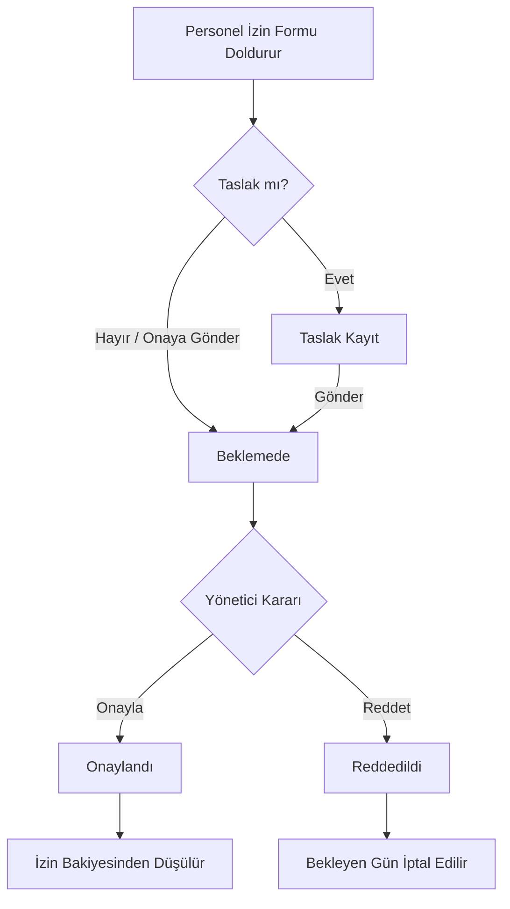
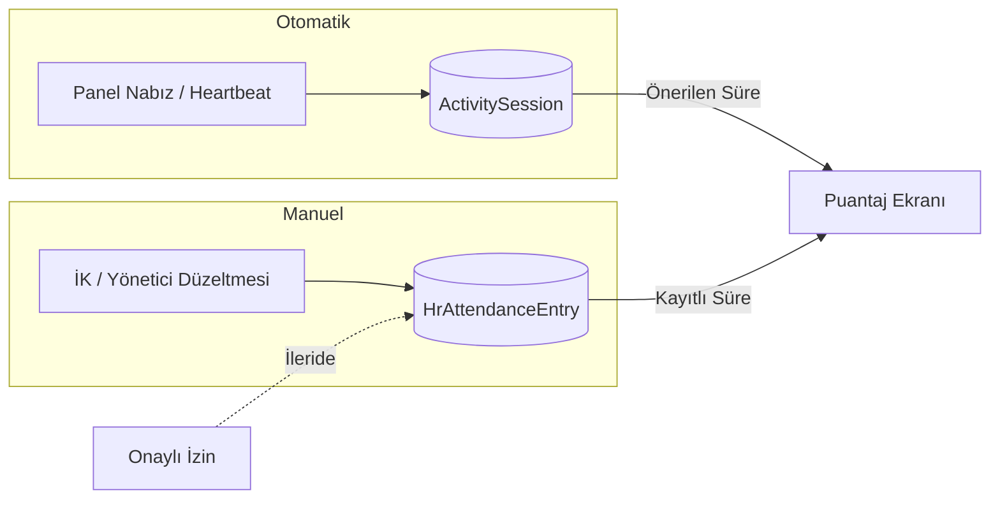

# Personel Özlük Modülü — Mimari Özet

Bu doküman, Meridyen panelindeki **Personel Özlük** dijital ortamının ne işe yaradığını ve nasıl büyüyeceğini anlatır. Teknik detay minimum tutulmuştur.

## Ne Var?

Sabah sunulan iskelet şunları içerir:

| Alan | Açıklama |
|------|----------|
| **Puantaj** | Günlük/aylık devam görünümü; panel nabzından (ActivitySession) gelen önerilen süre + manuel düzeltme altyapısı |
| **İzinlerim** | Personelin kendi izin taleplerini görmesi ve yeni talep oluşturması |
| **İzin Onay** | Yönetici / yetkili kişinin bekleyen talepleri onaylaması veya reddetmesi |
| **Özet** | Kalan izin günü, bekleyen talepler, puantaj özeti |

**Panel yolu:** `/panel/personel-ozluk`  
**Menü:** Sol menüde **Personel Özlük** (Personel Yönetimi’nden ayrı — o ekran dosya atama/iş yükü içindir)

## Kimler Kullanır?

| Rol | Ne Yapabilir? |
|-----|----------------|
| **Yönetici (Admin)** | Tüm sekmeler + onay kuyruğu |
| **Müdür (Manager)** | Kendi puantaj/izinleri + ekibin izin onayı |
| **Ofis Personeli** | Kendi puantaj ve izin talepleri |

Ekran görünürlüğü kullanıcı bazında **Ekran İzinleri** (`personel_ozluk`) ile de kısıtlanabilir.

## İzin Onay Akışı

**Durumlar:** Taslak → Beklemede → Onaylandı / Reddedildi

## Puantaj Veri Kaynakları

- **Nabız:** Kullanıcı panele giriş yaptığında arka planda çalışan heartbeat, günlük aktif süreyi `ActivitySession` tablosuna yazar.
- **Puantaj kaydı:** `HrAttendanceEntry` — manuel düzeltme veya nabız önerisinin onaylanmış hali.
- **İleriki faz:** Onaylanmış izinler puantajda otomatik “İzinli” olarak işaretlenecek.

## Veri Tabanı (Kısa)

Mevcut tablolar genişletildi; yeniden isimlendirme yapılmadı:

| Tablo | Görev |
|-------|--------|
| `hr_employee_profiles` | Personel kartı (kullanıcı, departman, yönetici) |
| `hr_attendance_entries` | Günlük puantaj satırları |
| `hr_leave_requests` | İzin talepleri ve onay durumu |
| `hr_leave_balances` | Yıllık izin bakiyesi (yeni) |
| `activity_sessions` | Nabız / oturum süresi (mevcut) |

## API Uçları (Backend)

Tümü `/api/v1/hr/...` altında, **Personel modülü** platform ayarında açık olmalıdır.

| Uç | Açıklama |
|----|----------|
| `GET /hr/summary` | Özet sekmesi |
| `GET /hr/attendance?year=&month=` | Aylık puantaj |
| `POST /hr/attendance` | Manuel puantaj kaydı |
| `GET /hr/leave-requests` | Kendi izinlerim |
| `POST /hr/leave-requests` | Yeni izin talebi |
| `GET /hr/leave-requests/pending-approval` | Onay kuyruğu |
| `PATCH /hr/leave-requests/:id/approve` | Onay |
| `PATCH /hr/leave-requests/:id/reject` | Red |
| `GET /hr/attendance/export?year=&month=&format=` | Puantaj Excel veya yazdırma HTML |
| `POST /hr/attendance/send-accountant` | Puantajı mali müşavire e-posta ile gönder |

## Mali Müşavir Çıktısı (2026-07-05)

Personel **Puantaj** sekmesinde **Mali Müşavir Çıktısı** paneli:

| Özellik | Açıklama |
|---------|----------|
| Excel İndir | Aylık puantaj + uyarı metinleri (.xlsx) |
| Yazdır | A4 yazdırılabilir HTML (yeni pencere) |
| Mali Müşavire Gönder | SMTP ile Excel eki; alıcı varsayılanı Ayarlar → Şirket Bilgileri → Mali Müşavir E-posta |

**Uyarılar (tüm çıktılarda):** Resmi defter değildir; e-imza yok; giriş/çıkış kaydı değildir; bordro kaynağı değildir.

## Ay Sonu Hatırlatması (2026-07-05)

| Kanal | Ne Zaman | Kim |
|-------|----------|-----|
| Panel bildirimi | Ayın 25–31 + ertesi ayın 1–5 | Personel (kendi onayı) + süreç sorumlusu |
| Personel Özlük banner | Aynı pencere | Tüm yetkili kullanıcılar — **Finans modülünde değil** |
| E-posta (SMTP) | Günlük cron 09:00 | İK / finans süreç sorumlusu (sinyal kuralı açıksa) |

**Kontrol listesi (finans/denetim):** Personel onayları → ay kilidi → mali müşavir çıktısı → bordro öncesi denetim.

API: `GET /hr/attendance/month-close-reminders` — Ayarlar → E-posta Bildirimleri → `hr_attendance_month_close` sinyali.

## KVKK Notu

Personel özlük verileri (puantaj, izin, kimlik bilgisi) **kişisel veri** kapsamındadır. Erişim rol ve ekran izni ile sınırlandırılmalı; gereksiz dışa aktarma yapılmamalı; silme/arşiv politikası İK ile netleştirilmelidir. Bu iskelet aşamasında veriler yalnızca yetkili panel kullanıcılarına gösterilir.

## Puantaj F2 (2026-07-05 — v184)

| Özellik | Durum |
|---------|--------|
| TR resmi tatil otomatik | ✅ 2025–2027 |
| Hafta tatili (Pazar) | ✅ |
| Onaylı izin → İzinli | ✅ |
| Aylık takvim grid | ✅ |
| Günlük personel onayı | ✅ `POST /hr/attendance/confirm-day` |
| Aylık personel onayı | ✅ `POST /hr/attendance/confirm-month` |
| Ay kilidi (yönetici) | ✅ `POST /hr/attendance/lock-month` |
| Ad-soyad dijital imza (aylık onay + ay kilidi) | ✅ F5b |
| 5070 nitelikli e-imza | ⬜ F5d |
| Mesai giriş/çıkış saatleri (rapor) | ✅ F5a — panel nabız referansı |

Mockup: `apps/web/public/dashboard-mockup-puantaj.png`

## F5a — Mesai Saatleri (2026-07-05)

- `hr_attendance_entries.clock_in_at` / `clock_out_at`
- Nabız: `activity_sessions.startedAt` → giriş, `lastBeatAt` → bitiş
- Onayla ile saatler kayda geçer; Excel ve yazdır çıktısında **Mesai Giriş / Mesai Bitiş** sütunları

## F5b — Ad-Soyad Dijital İmza (2026-07-05)

- `hr_attendance_period_locks.employee_signature` / `manager_signature`
- Aylık onay (`POST /hr/attendance/confirm-month`) ve ay kilidi (`POST /hr/attendance/lock-month`) imza zorunlu
- Backend: imza hesap ad-soyad ile eşleşmeli; Excel/yazdır çıktısında imza satırı
- **5070 nitelikli e-imza değildir** — F5d ayrı faz

## Sıradaki Adımlar (Önerilen)

1. **Personel kartı yönetimi** — İK’nın sicil no, işe giriş, yönetici ataması yapması (ayarlar veya ayrı ekran)
2. **Taslak izin** — Formda “Taslak Kaydet” seçeneği
3. **Puantaj düzenleme UI** — Tabloda satır tıklayıp durum/süre güncelleme
4. **İzin → puantaj bağlantısı** — Onaylanan izin günlerinde otomatik “İzinli”
5. **E-posta bildirimi** — Talep, onay, red
6. **Özlük evrakları** — Mevcut `hr_documents` tablosunun UI’ya bağlanması
7. **Bordro entegrasyonu** — Puantaj kilitleme ve dış sistem aktarımı

## Mustafa İçin Hızlı Kullanım

1. Panele giriş yapın.
2. Sol menüden **Personel Özlük**’e tıklayın.
3. **Özet** sekmesinde kalan izin ve bekleyen sayıları görün.
4. **İzinlerim** sekmesinden tarih seçip **Onaya Gönder** deyin.
5. Müdür hesabıyla **İzin Onay** sekmesinden bekleyenleri onaylayın veya reddedin.
6. **Puantaj** sekmesinde ay seçerek günlük listeyi inceleyin (nabız verisi varsa “Önerilen Süre” dolu gelir).

---

*Son güncelleme: Personel Özlük iskelet fazı — migration `20260704120000_personnel_ozluk_expansion`*
